# Основы программирования

# Семестр 2
## Занятие 7. Библиотека numpy
Установка: `pip3 install numpy`
NumPy - математическая библиотека, содержит математические фунции ориентированные (в том числе) на работу с многомерными массивами. Написана на компилируемых языках ( C++ и C). Поэтому код библиотеки выполняется быстрее чем код Python.

**Одномерный массив**
```python
import numpy as np
import random

# создание одномерного массива из 10 нулей
a: np.array = np.zeros( 10 )
# np.array - тип массив


# индексация с нуля
a[0] = 42
# длина одномерного массива
print( len(a) )
print( a.size )

# заполнение массива случайными числами
for i in range(0, a.size):
    a[i] = random.randint(0, 100)

```

## Занятие 6. Файлы
** Преобразование в строковый тип - функция str**
```python
x:float = 125.684
# преобразование в строковый тип
s:str = str(x)  # s = '125.684'

s2:str = f"{x:.2f}"
```

В записи строк могут использоваться специальные символы. Обозначения таких символов начинаются с `\`:
- `\n` - переход на новую строку
- `\t` - tab
- `\r` - признак конца строки

Например, строка s
```python
s:str = "Hello,\nWorld" 
```
будет при выводе на экран выглядеть так
```text
Hello,
World
```

**Файлы**
- https://raw.githubusercontent.com/VetrovSV/Programming/master/Programming_14_files.pdf

**Пример 1. Запись в файл**
```python
# открываем файл 'data.txt' как текстовый (t) для записи (w),
# используем универсальную таблицу кодов символов Юникод (UTF-8)
# чтобы открыть файл в режиме дополнения используйте параметр a вместо w
f = open('data.txt', 'wt', encoding='UTF-8')
# f - файловая переменная

# запись строкового значения в файл
f.write('hello, World!')

x:int = 42
# преобразование числового значения в строковое, запись в файл
f.write( str(x) )
# запись символа перехода на новую строку
f.write( '\n' )
f.write( '123456' )

f.close()
```


Содержимое файла
```
hello, World!42
123456
```

**Пример 2. Вычисление и запись отчёта в файл**
```python
print("m = ")
m:float = float( input() )

print("h = ")
h:float = float( input() )

bmi:float = m / h**2

print(f"При m = {m} и h = {h}, ИМТ = {bmi:.2f}")

# вывод в файл
f = open('report_1.txt', 'at', encoding='UTF-8')        # открываем текстовый файл для дополнения
f.write( f"При m = {m} и h = {h}, ИМТ = {bmi:.2f}" )    # запись форматной строки в файл
f.write('\n\n')     # вывод пустой строки              
f.close()           # pзакрытие файла (чтобы гарантированно записать в файловый буффер в файл)
```

**Чтение данных из файла**
```python
f_input = open('input.txt', 'rt')
m:float = float( f_input.readline() ) 
# .readline() -- чтение одной строки файла

# m:float = float( input() )
h:float = float( f_input.readline() )
f_input.close()

bmi:float = m / h**2

print(f"При m = {m} и h = {h}, ИМТ = {bmi:.2f}")

# вывод в файл
f = open('report_1.txt', 'at', encoding='UTF-8')
f.write( f"При m = {m} и h = {h}, ИМТ = {bmi:.2f}" )
f.write('\n\n')     # вывод пустой строки
f.close()
```

Файл input.txt:
```
80
1.83
```

### Задание
1. Добавьте к программам по задачам из первого раздела задачника запись отчёта о выполнении: выводите исходные данные и вычисленные значений в файл.
Открывайте файл в режиме дополнения. 
2. Дополните конспект по Питону:
    - пример чтения из файла
    - пример записи в файл в режиме дополнения
    - пример чтения нескольких чисел из файла
    - пример вывода в файл списка
3. Создайте новые варианты программ по задачам из первого раздела задачника, которые получают исходные данные не с пользовательского ввода, а из заранее созданного текстового файла.
    

В последующих задачах тоже записывайте отчёт.


## Занятие 5. Списки. Продолжение.

Конкатенация списков
```python
l1 = []      # пустой список

# конкатенация списков - добавление одного списка в конец другого
l2 = [100, 200, 300] + [400]     # 400 -- список из одного элемента
# l2 = [100, 200, 300, 400]

l3 = [100, 200, 300] + [400, 500] 
# l3 = [100, 200, 300, 400, 500] 

# конкатенация списков l1 (пустой) и l2
l4 = l1 + l2
# l4 = [100, 200, 300, 400]


# конкатенация списков
l5 = l2 + l3
# l5 = [100, 200, 300, 400, 100, 200, 300, 400, 500] 
```

Добавление элементов в список 
```python
l = []
l = l + [100]       # l = [100]
l = l + [200]       # l = [100, 200]

# добавление случайного числа
from random import randint
l = l + [ randint() ]       # l = [100, 200, 42]
```

Заполнение списка случайными элементами
```python
l = []
n:int = 10

for i in range(n):
    l = l + [ randint(100) ]
```


**Списки из списков**

#### NumPy
```python
import numpy as np
```

## Занятие 4

### Установка новых библиотек (пакетов) для Python**
```bash
pip3 install <название-библиотеки>
```
- `pip3` -- консольная программа для установки и удаление библиотек Python
- `install` -- команда установки
- обязательные аргументы приведены в угловых скобках

Например, установка библиотеки для создания графиков matplotlib
```bash
pip3 install matplotlib
```

Так как программа pip3 консольная, то запускать её нужно из командной строки, например power shell в Windows
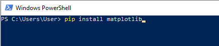

Если в вашем PyCharm используется не системный интерпретатор Python, а своя копия, то можно установить библиотеку matplotlib для неё
Откройте панель установки библиотек PyCharm: меню View > Tool Windows > Python Packages

Внизу откроется панель:

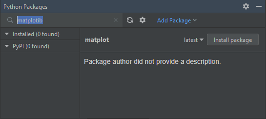

1. В поле для поиска укажите имя библиотеки для построения графиков: matplotlib
2. Нажмите Install package


### Создание графиков
Пример создания простого графика
```python
# подключение из библиотеки matplotlib модуля pyplot по именем plt (для краткости)
import matplotlib.pyplot as plt

# создание значений для X и Y в виде списков
x = [1,2,3]
y = [2,4,6]

# нарисуем график по точкам
plt.plot( x, y)     
plt.xlabel("ось х")         # задать подпись к оси x    
plt.ylabel("ось y")         # задать подпись к оси y
plt.grid(True)              # показать сетку

# покажем окно с графиком
plt.show()
```

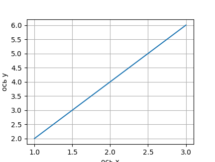


Дополнительно можно задавать стиль линий и точек, цвет и толщину графика:
```python
plt.plot( x, y, '--')       # пунктирная линия
```

```python
plt.plot( x, y, '-o')       # линия с крупными точками
```

```python
plt.plot( x, y, '--', lw = 2)       # пунктирная линия толщиной 2
```


```python
plt.plot( x, y, '--', lw = 2, color = 'red')       # пунктирная линия толщиной 2, красного цвета
```


```python
plt.plot( x, y, color = '#094882')              # цвет задан кодом в формате RGB, шестнадцатеричными числами
```
Код цвета можно [подобрать](https://www.google.com/search?q=%23094882), например в google.com

### Задание
1. Дополните конспект примером построения графика с комментариями 
1. Постройте график функции sin(x) для значений x от 0 до 10 с шагом 0,05
1. Заполните список по формуле из задачи 139, постройте график этих значений


# Занятие 1
12 января

- Доделайте не сданные задания.
- Создайте конспект-шпаргалку с примера кода на Python
    1. Объявление переменной простого числового типа
    2. Вывод строки и переменной на экран, форматный вывод, форматный вывод нескольких переменных
    3. Считывания значений в числовые переменные
    4. Условный оператор
    5. Циклический оператор while и for; досрочный выход из цикла и переход на следующую операцию
    7. Нахождение суммы известного числа слагаемых
    8. Объявление списка из чисел; определение длины списка
    9. Вывод списка на экран
    10. Заполнение списка случайными числами, с клавиатуры, по формуле
    11. Изменение элементов списка по формуле
    12. Поиск числа в списке
    13. Объявление функции без возврата и с возвратом значения; вызов функции (укажите формальные и фактические параметры)
    14. Дополните конспект материалами на свой выбор


# Занятие 12. 

Пример функций для списков (массивов)
```python
# дан массив a1, ..., an
# вычислить a1^2, ..., an^2

from random import *

# ===== объявление функций =====

def print_list(lst: list):
    """выводит список lst на экран"""
    size = len(lst)    # получение длины списка (количества элементов)
    for i in range(0, size):
        print( f"{lst[i]:.2f}", end = " ")
        # вывод элемента списка через форматную строку: f"{lst[i]:.2f}"
        # .2f -- формат вывода вещественного (float) числа с двумя знаками после запятой


def square_list(lst: list):
    """создаёт новый список C из списка lst, по формуле: C[i] = lst[i] ^ 2 """
    size = len(lst)  # получение длины списка (количества элементов)
    C = [0]*size
    for i in range(0, size):
        C[i] = lst[i] ** 2
    return C                # возврат значения из функции


# ===== основная программа =====

# глобальные переменные
n: int = 12      # количество элементов в списке
a =  [0]*n       # исходный список (массив)
a2 = [0]*n       # массив из квадратов

# заполнение списка случайными числами
for i in range(0, n):
    a[i] = uniform(-100, 100)

# вывод списка на экран
print("исходный список a1, ..., an: ")
print_list(a)           # вызов функции print_list с фактическим параметром a
print()
print()

# вычисление a1^2, ..., an^2, запись результата в список a2
# вызов функции square_list с фактическим параметром a, запись возвращённого (return) функцией значений в переменную a2
a2 = square_list(a)

# вывод списка квадратов на экран
print("список a1^2, ..., an^2: ")
print_list(a2)   # вызов функции print_list с фактическим параметром a2
```

Создайте новые версии  своих программ используя процедурную декомпозицию (разделение программы на функции) для заданий из разделов задачника:
- Арифметика действительных чисел;
- Простейшие циклы;
- Массивы;
- Массивы, циклы и разветвления.
Напишите комментарии, документируйте функции.


<br>

# Занятие 11. Случайные числа. Функции.

### Случайные числа

**Целые**
```python
from random import randint      # подключение функции randint из модуля random
x = randint(0, 2)               # randint(0, 2) возвращает случайное целое значение из отрезка от 0 до 2
```

**Вещественные**
```python
from random import uniform       # подключение функции randint из модуля random
x = uniform(0, 10)               # uniform(0, 10) возвращает случайное вещественное значение из полуинтервала от 0 до 10 (10 не включая)
```


**заполнение списка случайными числами**
```python
from random import *        # подключение модуля для работы со случайными числами

n: int = 150    # размер списка (число элементов)
a = [0] * n     # список из n нулей

# заполнение списка случайными числами
for i in range(0, n):
    a[i] = randint(-100, 100)
```


### Функции

```python
# подключение модулей, если необходимо
from math import *

# объявление функции
def calc_hypotenuse(k1: float, k2:float):           # k1, k2 -- формальные параметры функции
    """вычисляет гипотенузу по катетам k1 и k2"""
    h = sqrt(k1**2 + k2**2)   # sqrt - вычисляет квадратный корень
    # h - локальная переменная
    return h            # возврат значения из функции


# объявление глобальных переменных
a: float = 0       # катет
b: float = 0       # катет
c: float = 0       # гипотенуза

# сообщение пользователю
print( "Введите катеты треугольника: a, b" )

# ввод данных
a = input()
b = input()
# преобразование типов данных
a = float(a)
b = float(b)
# вычисления

# вызов функции; a,b -- фактические параметры, подставляемые на место k1 и k2 при вызове функции
c = calc_hypotenuse(a,b)

# вывод данных

print("Для катетов a =", a, "; b = ", b, "; гипотенуза = ", c)

# приветствуются комментарии, поясняющие алгоритм и сложные, только что изученные места в программе
```

# Занятие 10. Форматирование вывода.
ноябрь 24

В Python можно подставлять значения переменных или выражений в специальные **форматные строки**.
Такие строки начинаются с префикса `f`, а переменные или выражения записываются внутри фигурных скобок
```python
x:int = 42
print( f"answer: {x}" )
```
Вывод программы:
```
answer: 42
```

Для значений можно указывать формат, после двоеточия. Например, количество десятичных знаков для вещественного числа:
```python
y:float = 55 / 7        # 7.85714285714
print( f"answer: {y:.2f}" )
```
Вывод программы:
```
answer: 7.86
```

Подробнее про форматные строки: https://pythonz.net/references/named/str-f/

**Вывод списка в одну строку**
Оператор `print` после вывода данных всегда переводит курсор на следующую строку. 

Например:
```python
a = [12, 45, 33]
for in range(0, 3):
    print( a[i] )
```

Вывод программы:
```python
12
45
33
```

Но набор чисел удобнее читать когда он записан в строку, особенно если там много элементов. Чтобы print не переходил на новую строку добавим в него параметр end = " ". Т.е. после вывода данных print вместо перехода на новую строку выведет пробел. 

```python
a = [12, 45, 33]
for in range(0, 3):
    print( a[i], end = " " )
```

Вывод программы:
```
12 45 33
```


### Задание
1. Сделайте форматный вывод в ваших программах на тему "Арифметика действительных чисел". Выведите ответ и исходные данные с помощью одного оператора print.
2. Используйте форматный вывод в последующих задачах

# Занятие 9

ноябрь 17

Списки. Пример

**Задание**
1. Напишите программу, которая запрашивает у пользователя n чисел и записывает их в список.
Выведите этот список. Напишите комментарии.

2. Выполните задачи до блока "Массивы. Простейшие циклы" включительно

```python
# Даны натуральное число n, действительные числа а1,..., an. Вычислить:
# е) a1 + 1, a2 + 2, ..., an + n

i: int = 1      # Счётчик цикла
n: int = 5      # размер списка (массива)
# todo: запрашивать n у пользователя

# список (массив) из n нулей
a = [0] * n

# заполнение списка числами
print('Enter numbers')
for i in range(0, n):
    a[i] = float(input())

# список (массив) из n нулей
b = [0] * n

# вычисление по условию задачи
for i in range(0, n):
    b[i] = a[i] + i+1
# нумерация элементов в списке с 0
# range(0, n) последовательно выдаёт число от 0 до n-1 включительно

# вывод результата
for i in range(0, n):
    print(b[i], " ")

```

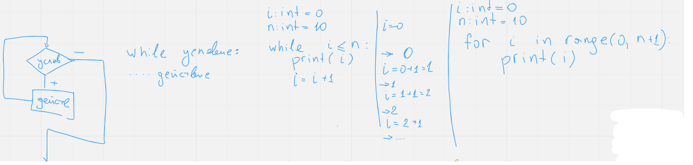
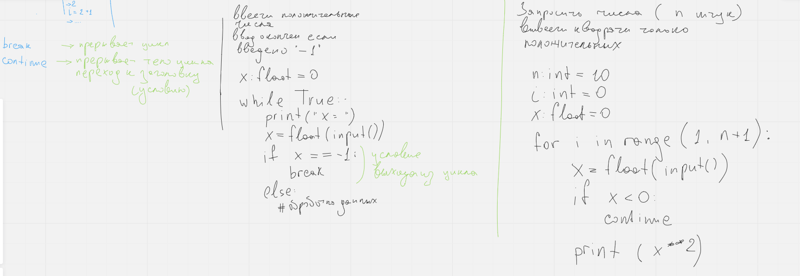
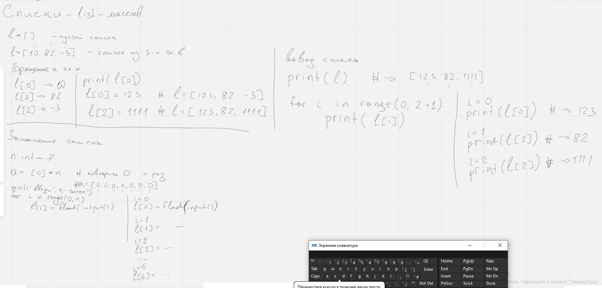

Слайды лекции: 
1. https://raw.githubusercontent.com/VetrovSV/Programming/master/Programming_02.pdf#Navigation80
2. https://raw.githubusercontent.com/VetrovSV/Programming/master/Programming_03.pdf

# Занятие 8
ноябрь 10
- цикл for; операции break и continue
- списки
  - https://raw.githubusercontent.com/VetrovSV/Programming/master/Programming_03.pdf

### Домашнее задание
- Решите задачи из раздела Циклы на суммирование определённого количества элементов с помощью цикла for


# Занятие 7
ноябрь 3
1. Циклические операции. Цикл с предусловием. Цикл с постусловием. Примеры. (продолжение)

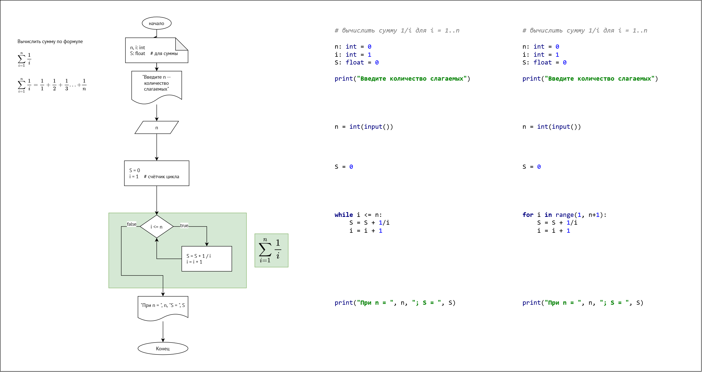
https://raw.githubusercontent.com/VetrovSV/Programming/master/Programming_02.pdf


# Лекция 6
октябрь 27 
1. Циклические операции. Цикл с предусловием. Цикл с постусловием. Примеры.
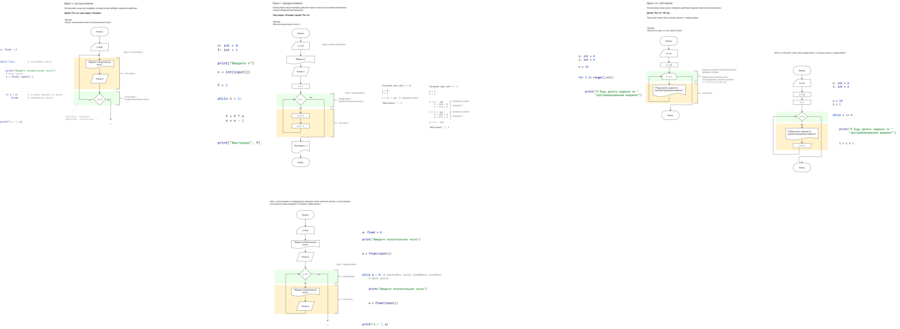
https://raw.githubusercontent.com/VetrovSV/Programming/master/Programming_02.pdf
 

# Лекция 5
октябрь 13
1. Сообщения об ошибках. Логические и синтаксические ошибки.
1. Логические операции.
1. Условный оператор. Вложенность.

Слайды: https://raw.githubusercontent.com/VetrovSV/Programming/master/Programming_01.pdf

#### Примеры
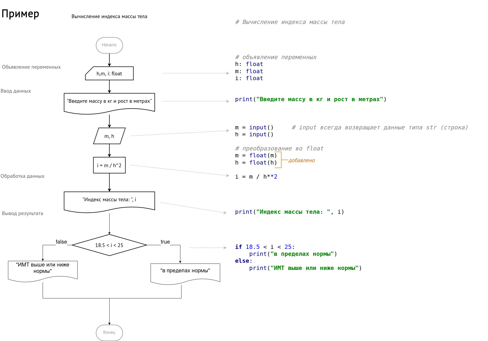


# Лекция 4. Введение в Python
сентябрь 29

1. Характеристика Python.
2. Создание проекта в PyCharm.
3. Определение переменных. Определение типа данных. Комментарии. 
4. Ввод и вывод. 

Слайды:https://raw.githubusercontent.com/VetrovSV/Programming/master/00_intro.pdf
WolframAlpha (для проверки вычислений): https://github.com/ivtipm/Programming/blob/master/wolframalpha.md

# Практика 4

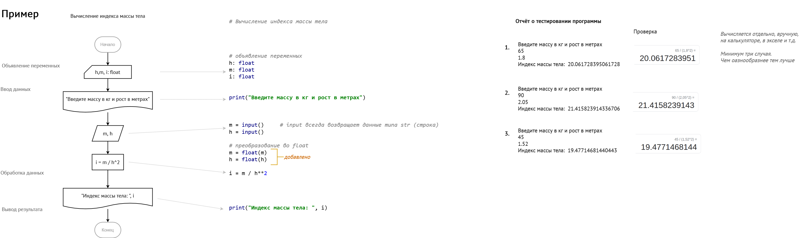

Пример оформления программы:
```python
__author__ = "Пушкин Александр"
"""
Условие задачи ...
Ссылка на задачник: https://github.com/VetrovSV/Programming/blob/master/2022_s/plan1.md
"""

# подключение модулей, если необходимо
from math import *

# объявление переменных
a: float        # катет
b: float        # катет
c: float        # гипотенуза

# сообщение пользователю
print( "Введите катеты треугольника: a, b" )

# ввод данных
a = input()
b = input()
# преобразование типов данных
a = float(a)
b = float(b)
# вычисления

c = sqrt(a**2 + b**2)   # sqrt - вычисляет квадратный корень
# вывод данных

print("Для катетов a =", a, "; b = ", b, "; гипотенуза = ", c)

# приветствуются комментарии, поясняющие алгоритм и сложные, только что изученные места в программе
```


1. Сделайте задачи из первого раздела на Python. 
2. Сделайте отчёт о тестировании

## Домашнее задание
1. Скачайте рекомендованную литературу
2. Изучите все слайды лекции
3. Сделайте задачи из первого и третьего раздела задачника на Python. Сделайте отчёты о тестировании
4. Какие синтаксические ошибки у вас возникли в процессе создани программ?
5. Дополнительно: Решите задачи из раздела "Простейшие циклы" с помощью блок-схем.

## Литература
1. Изучаем Python, том 1, 5-е изд.: Пер. с англ. — СПб.: ООО “Диалектика”, 2019. — 832 с.

# Лекция 3
22 сентября

1. Интерактивный режим работы Python


# Практика 3
22 сентября
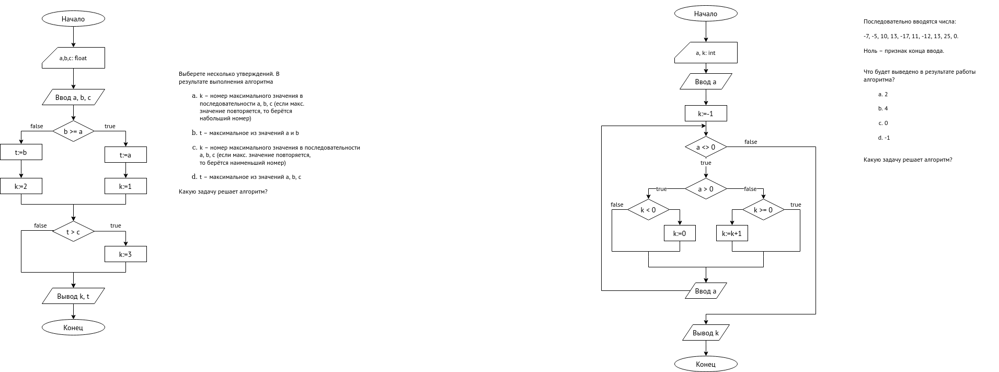

Защита блок-схем

1. Запустите интерактивный режим интерпретатора Python
    - Попробуйте вычислить простые арифметические выражения. 
    - Результат вычислений автоматически сохраняется в переменную `_`
    - Вычислите итоговую сумму вклада $S_0$ через t лет с процентом p $S(t) = S (1 + \frac{p}{100})^t$ \
  Вместо переменных подставьте числа. Возведение в степень в Python обозначается: `x**y`
    - Задайте значения переменных для вышеприведённой формулы. Вычислите результат.
1.  Подключите математический модуль: `from math import *`
    - Вычислите приближённое население Земли (в миллиардах) по приближённой формуле:
    $P(t) = C e ^ {kt}$, где C = 3.0402, k = 0.016476, t – количество лет, прошедшее с 1960 года[ [источник](https://www.researchgate.net/publication/276525012_Modeling_Population_Growth_Exponential_and_Hyperbolic_Modeling) ].


<br>

# Практика 2.
15 сентября
- Защита блок-схем
- Выполнение задач 5, 6, 7 в виде блок-схем?


# Лекция 2
15 сентября
1. Опрос


### Домашнее задание.
- Задачи из строк 5, 6, 7 в виде блок-схемы.
- Задачи 1 и 3 на Python?
- Изучите слайды 1-92

<br>


# Практика 1.
8 сентября
- О курсе. 2 семестра. В конце дифференцированный зачёт.
- Программирование на Python.
- Блок-схемы. Типы данных.
- draw.io. Оформление задач.
- Задачник: [ivtipm.github.io/Programming/Files/spisocall.htm](https://ivtipm.github.io/Programming/Files/spisocall.htm)
- Варианты. Пропуск задач: 2, 4, 11, 15, 19, 23, 27


[исходник](https://viewer.diagrams.net/?tags=%7B%7D&highlight=0000ff&edit=_blank&layers=1&nav=1&title=Flowchart_explained.drawio#R7V1bk5s4Fv4t%2B%2BCqZKu6C8TNPPrWyWaT2tR2tpLZN9qmbWZs04PptHt%2B%2FUgghC4HAzbYuEO6yrEFCJC%2Bcz86GhiTzf5D5D2tvoQLfz1A2mI%2FMKYDhGzTMfB%2FpOU1bTGQZaYtyyhYpG163nAf%2FOXTRo22PgcLfyecGIfhOg6exMZ5uN3681ho86IofBFPewzX4l2fvKWvNNzPvbXa%2Bj1YxKu0dWhpeftHP1iusjvrGj2y8bKTacNu5S3CF67JmA2MSRSGcfpts5%2F4azJ62bik190VHGUPFvnbuMoFD588%2Bz%2F7D%2F%2F10edV%2FKJ9%2BzSe%2F%2B8G0WeLX7MX9hf4%2FenPMIpX4TLceutZ3jqOwuftwie9avhXfs7nMHzCjTpu%2FN2P41c6md5zHOKmVbxZ06OP4Ta%2B8zbBmoDi6zd8%2F3tvu6MH7sPnaE6uW8UxnmNkGSP8gd%2BKfJATdrfLMFyufe8p2N3Ow01yYL5LTr17TLvFX5OOLTTmu04fSLfxb3X06IDusvsXDRk9j4wTdyEd8w9%2BuPHjCD%2BBFvlrLw5%2BijjyKByX7Dx26dcwwI%2BCNEo7RgYxSjlWhqOsi9iLln5Mr8rnHX%2FhHiNvStBQAxn0gX9662f6CgM83%2B6UfI61AZ7IoZN9x5%2Fj5HOmwGkXR%2BEfjHSQCARMEk%2FkvM1%2BSdjH7eM6fJmvvCi%2Bjf1oE2y9OIzwaS%2BrIPbvn7xkWl7wmXXm86cfxf7%2B4ExlI66JI2649PdLTviMvFcc0dta8eQK01J3Dkx4DkZ0rMlnOh9WMh%2F2NY%2B%2BKY2%2BaVsXHn3rV%2BWNeBKj1x%2FkHW6t7Odv9JWSH9O98OuV%2F%2FXVjwI8%2Fn5EGwuhkfKvcvS3zWhN0711MLLYP1PCYTW%2BW7dfxl2yflPB0xo%2Fd1Veguw1Hv%2FxIviJvy7J1%2F0ATfBNRkRTWoceeZt3CYNBHJtxue968pkeRe%2BzHvEDcp0C98FyYkJ0pPS%2F%2Bel3fIjku4nPsE1vkU7QO8otaaec9Epa3qtslHLKuRctCjhix0hYZfzeOljiUZiu%2FUcyIDv8%2BMF2%2BTn5NUUa7WMSrgnTxy9tIJP8sb64I7pD%2Fpph%2B7ZliWRhq0IXOZbK9mXyaYzt64Dmg%2Bw%2Fn4mePv6IOwhT1H4PI2xLsCOFoFmE8%2BdNMkBlwHlIhcfnhy4hqT4qVOw1gBNd17VSoOjOOfUDHR0ACuakWtKm8RCZJC%2FUI%2BWsSDGHF0eKASvyKBFEY07epSLIJLAhX%2B6yRnzaXSb%2BUq2ftcxEEYk%2F3ezyKWegmVyHQ66rYXbyMMWqLE7JIUfsjZl%2BFtc%2BpI8kPHkqsjXu5Ily4ZR7cVehDTzpsYh9SZARYARzbz2izZtgsUhVcX8X%2FOU9JB0R8fZENKtkZq3xwJqSnrD2vaMAVnC6Dbekl8dgvZabANwX0h5EEEkH9BVRE4hnvDBDvAMIURNAvNUa4gtMV5Ob%2FhGnemkcUDROwxtytMHjL8UZ74PgVUP8OSlCUgXljU4uU4pqTW4jOpE4nQhwRCDIFDZbm04Lns5SbxDHWvIpr%2BK5uJ7ZQq7VtdmyK4kb9l0SOiY3kYxFpyfjT9Urcj1TpagGHZgr5xjVgPFHxkkly1grmqVekNYRpKCRgQB8GK3hY3iskTERm8kR7bXwgtfeKjmvVWJB0YXzWiWAS7AVq2SYCY7qVolkyDRrm%2FCah67oJWOqP%2Bbt0vPXMm3K5WbPketwZAsw5hmJnMW0ydg%2FQDZFBPOGNaph52wVpPpv92UyDo%2BBt17763AZeRtCUFwQSzjGRbdKpyfY%2B1lCSweE4ZEu%2FnaE4RCV61kgaloThghw5hKqvuPY%2FEyMGzGVG78sDVrNCgSExl1JhZEaZboeqsc9dY7qVRfrPVN2iZ78z4MMIPLnsbddJtK1J%2F5i4hfDhrqmKi1twKsD7AHwZ6ph7arRaDgiTsG6oWCdD6wZqnx9bgqa1S8CKQQP4biBx3g3Y129vk%2B%2BEv37Hen2hnT7nh2Ol%2B%2FonSuH83s6PpGOD2YDJGQtGx8xSWDKTvyWZDMR50Q7BG9BAYwhQPDMGdM8xQNOVIDic4M5M1zrWYnM0mYXmqItij9t4WR6ms5ZECzkoSlaCG9Ua3I%2Fx7MrausIj3xKVIeF%2Fw5EdciF%2F6jID3rbuoIWrlBdltHAU50LUF17tjXgDe%2BJrie6t0N0WD%2BTYvUaIOrOS3RgiKEnup7o3gzR2U7niK4g%2BDLhQGILsAFSKCYZfTCk8fEOnkSQiEyehupGQ2YQ8R1wdmVoh8M3JncXltSjc%2F2PlJ75VDc1vsPoyBJZUcoJeuKpTzyOIamJlko8hnFO4sluJhMPLwLuCkDsJN8Niks%2Bk4LCGnHihsFOYuI8W9eUdisDYmmOhhhPRXzylMXdYsaB2OAYgUQYMxb0VyiNeqmz3hgX4FPmDGXcJiJBqg%2Bm5YOGNBLg1p7insiaIDLbBIgM8oC0R2TgOoje5dm7PK%2Fb5TnHVJqMQ2WnZxseTgeKmEHpP3prMQ1DDXluBZLqAXeFsTLz4rEyA4qVSVjyt4sRqc6Ri2QOEOIi6quCw8TVNDxsB6a2dDkzN2%2FWAXl%2F4qpn5Ej5iK4j4aFgPbLak5yi5cg9tVypwihYnNCUIi9p6Lq4dHjKadAap6FLZqzDWbvJUTdTvQsVdg16tlRPT5V90FxQTzCUEeCtZjt7ZuYQ4F1S4nvlr8BSPZntjziPlmT6SEN6OfOgltqfq%2FcK%2Fc9G9thuqO6Fovk7QIajAeWcN6H5%2F9iPZw9%2FfHRe%2Fr1Hu%2Fvg3vr%2Fd1RQ%2BmVkKKYg71sqmd4ryGoyZEZ21qwmcCbgVXSCyw6QrW%2B%2BSkkCkRqZiXxNJ3CcjYqy%2BdSaTobshx62JirB94QlJRNLPZKuBkls%2BciFkAStaGeqR10ZcWSZqoU%2FD3ZBuC0QL12AVhNiSa6MZQD%2Bdx1aAsHKZTUul%2BBFiz0fkWF8bCWt4%2FkPjeXzxbVgHU87E6OyJUZlV7QOR1HkvXKnUeX%2BwI0kR4hNF60X2a3qBfRJc8JIn6FRvlmwNrtX6ZolIH8fxD%2B477%2FlXeBf%2BUXkB39N5ep1zRHi2XRPybqxz6wxqFlG08zbbHsbIrBpnENTBUivIBxUEOQAfdXSme0pCIxMeh52Ag%2FJhHQpE0GNS%2FPTHEhAfgYQONUz%2BtdINJSESB8GWYR092cUv5uSiGkeSUXsm1c9OovAm9wcf4sKUbG%2BTsLxzMzSYa1McMJB7tAm4lkwcZmX4GXHaj5vjgcaVXkgakWRqm2HGIZYD8o1BbNCvcCULCTpgpbsEMCBk5eEyd39RYEzMLIjJpSy2h00eY1dxQeMNDGn2lWy5JjnSAoq8Tl9UjUFKVGWvcVUuFFfufVMHB0V2NkCR4fyR9vj6EavnZ7OmVFl7bQjnFl2%2BHSTM0P1ZcC8y6wIWK5GK1XA9OrLXPL%2BUHF%2FqKZS3HPQZnRiTVQpWPmUy3FQpIJ0Wmtrkpyd6uXo6Cbr9KI5PcFqy5XjQlXizmv9FK8OXOnC4kC%2BVI6k9CXtOevgLpRhoWYDVc3pp%2BmWZDYGcqGCZAIhjIV4boi%2FkKAnWCz8rSLouwC9BpB1g%2BR8P6gqOrQETo7XNIes4i1JJGTNuKgyv4oSido%2Fv%2FRmquTGqctRswTBfJ2pFLUe3RSuJzuUtd%2FD%2B%2FLwRkCQ3NQBeOtNlG6FUySuym8Ebt7UBXSocnf%2BHP1kmsPx9otR1X7JVkJ1xLtetPrxDW%2FNp0tVJvNquufYHQ6eheER1C0gt3cRN5VzB%2BwoB5%2FodIuQ1UTrFTa06a5ogbArWoGBfRU7ktWd8DpVtSW%2BgADLWG9r2Sw8qQWWMb8axeF82urSatCpzpd3kIqQcFVP6MkTThLo3Oc4044lRzqYtFe8LoOtoLzowu3D6wSaAJcUyNE1QOgYkE7Z3noAyDd4YSl0ZcylXJo4VaWJ2y1pAtZO4yJ6QoVyi%2BMkYnCthIew%2BhMsfjeiq8wYp0J8NaSZENGTr%2BU9RIi7SstieW84SNeeWJSciLoBSEUD2g9MTglsjnEBUrFnXA0zLrci4zI7Zs%2BqfkCqAq8Kqf5cBfsrr0lsCS%2FtaM1SCULdhFaUnDXKYB7jK%2But6TbYiFnVmjYbz1w%2FDUKqNR0M%2BApDaV7nKi3uI4GtyeXJV80KrKo7nrXHCtRY8bWwgivyoZ%2FAH6omZJpWt%2FhDWcajW%2BZjOcW7kvjy5HyaoLdqTrBqoDzCM1s1BZVnqmfBXHMMBspCOm8MxoRcHrLsUCpNLbzdismKTpedKgl9SulpdvKnOFPxkfEd%2BTsEg45UpbrRkeRztWVHfdWyVLZW1lPL6x1NKHGqB%2Bc1g1OWQJacO1IdnGU9tQ1OKPeqB%2BdbAierXnUyOJWe2q5SVJDg0vwOqx2tSV2rBBoDbwM6npJGp0M10HRIyW4t5mnB5ejcWZa0Ka1S07mwE%2BICVFqPlZaxYkNJWVBKcXtYAcJM09ItzaV9a%2FgdAtgqQ65qP%2F%2B9x0pFrMjauAOFHKBEnfawApUwk%2FjKiCtziqol6vwau8N3CEkI2sunLQn15c7a%2FuuTsfhqv27vrN%2B%2FuONXH6qFd0CXnq%2B93S6YH9Kgi9xnkq4JDOWl1E%2BD1R%2FMitTpR2qfak%2Ft2e3gbNarXn7UbDYaX6gKjQoe%2B2GnIGShoyEkrds1ZA9kyxCq4vlpfyXI8VxEjAKBr2ipkALPs2FINR7yOfSQ%2FZ7wndjnQhHyleRX0T4Xug5pkFA2bhPhBxBe7puj6lOpFebHyHQkne3cMl0tutnvdHP9HABa43leDgDXQXbvOBeUur6D3%2FZW9SmA1Y2UPOqpXrALbulGnLCZeZ7tGRqef63qRpStWX666gG6iAg4rc50XduhWNdqQXQMZdFRUZevIIWU8qcFBkZTUgh1BC0NKgw6amfa5U1xdKNigLRuUShkW7I%2FaXi4KpT6bNIVJ5eFOjDSvTHzJlQZJcSqQ2G2s6oyl6nY3KSn82I8R%2B1qqJm3LvdPZjEVk5pqM7Oh4hzvKDNTnay9QXZ1XMxRqnJcnIvpaiDtV1XI21LNbFtx5lhHskmF%2BVTVyGszRvVORgljVPRC6YqWGCOwPUxWEw2xqmIzNHAn6fJoVnMMldUcK2GFTTAEYyhLUKhQ5VkN9KOScDud2lhZPkh7EXc3eIxcRfM6NnqMLBmCutxVy65m%2FeqiAuWSxDyTJEEy%2B38TkkRRyk%2BUJPhnFJJVZPnpZHnQl3DhkzP%2BBg%3D%3D)


# Лекция 1.
8 сентября
Слайды: [00_intro.pdf](https://github.com/VetrovSV/Programming/raw/master/00_intro.pdf)
- Элементы блок-схем. 
- Высокоуровневые и низкоуровневые языки программирования. Транслятор. Интерпретатор и компилятор.
- Понятие алфавита, синтаксиса и семантики.

### Домашнее задание.
- Задачи из строк 1 и 3 в виде блок-схемы.
- Конспект: Этапы разработки ПО. Критерии качества ПО.
- Установить интерпретатор Python и IDE PyCharm
- Изучите слайды 1-34
