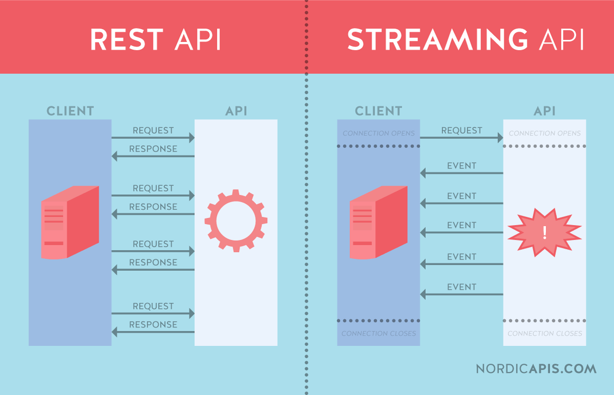
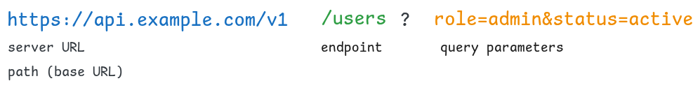
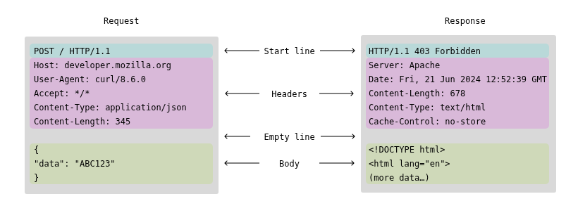

# OpenAPI
**OpenAPI** — спецификация для описания RESTful API. 

Помимо требований к API, спецификация позволяет документировать все доступные конечные точки (endpoints), параметры запросов, схемы ответов, коды ошибок, а также другие аспекты API. Работает на основе протокола HTTP.

Позволяет декларативно описать API в специальном файле (например в JSON или YAML: OpenAPI.yaml или swagger.yaml). На основе такого файла можно сгененировать шаблон серверного кода: заготовки для обработчиков эндпоинтов, типы данных (схему данных), документацию и т.п.

Аналогично но основе кода сервера, можно сгенерировать файл спецификации, документацию и т.п.

Ранее известная как Swagger, спецификация OpenAPI стала де-факто стандартом для описания веб-сервисов. Благодаря своей универсальности и широкому сообществу, OpenAPI используется для генерации документации, тестирования, мок-серверов и даже клиентских SDK.

**Инструменты:** Swagger UI, ReDoc, Swagger Editor, OpenAPI Generator, Spectral (линтер), Stoplight, Postman, Insomnia.

**Аналоги и альтернативы**

* **RAML** (RESTful API Modeling Language) — другой язык для описания REST API, позволяющий структурировать документацию и интегрироваться с рядом инструментов.

* **API Blueprint** — фокусируется на легкости написания документации в формате Markdown, что упрощает чтение и редактирование.

* **GraphQL** — хотя GraphQL не является прямой альтернативой для описания REST API, он представляет иной подход к взаимодействию между клиентом и сервером, где клиент формирует запросы, а сервер возвращает строго определённые данные.


OpenAPI 3.0 в стандартном виде не предназначен для описания протокола WebSocket, так как его фокус – синхронные HTTP взаимодействия. Для описания асинхронных или постоянных соединений (например, WebSocket) существует другая спецификация – AsyncAPI, которая специально разработана для событийно-ориентированных и двунаправленных коммуникаций.



**Статус стандарта**

Широкое распространение:OpenAPI является де-факто стандартом для документирования REST API в современном веб-разработке. Множество инструментов, таких как Swagger UI, OpenAPI Generator и Postman, поддерживают спецификацию OpenAPI.

Спецификация регулярно обновляется и развивается.


**Особенности**

* Спецификация описывает все аспекты API – пути, методы, параметры, схемы данных и коды ошибок.

* Машиночитаемость. OpenAPI-документы в формате YAML или JSON легко анализировать, что позволяет автоматизировать генерацию документации, кода клиента/сервера и тестов.


**Плюсы**

* **Унификация.** стандартизированное описание API помогает командам легко понимать и взаимодействовать с сервисами.
* **Автоматизация** возможность генерации документации, клиентских библиотек и тестовых сценариев на основе спецификации.
* **Широкий набор инструментов** для разработки, тестирования и мониторинга API.
* **Снижение ошибок**. Детальное описание API помогает выявить и устранить несоответствия на ранних этапах разработки.


**Минусы**

* Спецификация может быть довольно подробной и объемной, что затрудняет ее поддержку в больших проектах.
* Кривая обучения: требуется время, чтобы освоить синтаксис и лучшие практики написания спецификаций.
* Обновления:Необходимо синхронизировать спецификацию с реальной реализацией API, иначе документация может устаревать.


**Когда стоит применять OpenAPI?**

* Нужно документировать REST API:Когда требуется единое описание для разработчиков, тестировщиков и сторонних интеграторов.
* Автоматизация процессов:Если важно генерировать клиентский/серверный код, мок-сервера или проводить автоматизированное тестирование.
* Масштабирование проектов:При наличии нескольких команд или микросервисной архитектуры, где требуется единая спецификация для взаимодействия между сервисами.
* Публичные API:Для обеспечения прозрачности и удобства использования сторонними разработчиками.


**Когда не стоит применять OpenAPI?**

* Простые или экспериментальные проекты:Если API крайне простой или используется в тестовых/пробных целях, затраты на поддержку спецификации могут перевесить выгоды.
* Альтернативные архитектурные стили:Если используется GraphQL или другой протокол, не основанный на REST, спецификация OpenAPI не подходит.
* Маленькие команды или быстрые прототипы:Когда скорость разработки важнее детальной документации.

## Основные понятия и термины


* OpenAPI Specification (OAS) - Документ, описывающий API (форматы YAML/JSON).

* Paths - Маршруты или конечные точки API, например, /questions или /users/{id}.

* Operations - Методы HTTP, применяемые к маршрутам (GET, POST, PUT, DELETE и др.).

* Components - Переиспользуемые элементы, такие как схемы (schemas), параметры, заголовки, ответы и т.д.

* Schemas - Определения структур данных, используемых в запросах и ответах.

* Security Schemes - Описания механизмов аутентификации и авторизации (например, API-ключи, OAuth).

* Tags- Механизм группировки операций для лучшей навигации в документации.

* Servers - Определяют базовые URL, по которым доступен API, и позволяют указывать среды (продакшн, тестирование и т.д.).


**Важные замечания и рекомендации**

* Поддержание актуальности:Спецификация должна обновляться параллельно с изменениями в API. Это помогает избежать расхождений между документацией и реальной реализацией. Обычно сразу выбирают единый источник истины (Single Source of Truth, SSOT): либо код, из котогоро генерируется спецификация или документация, либо спецификация, на основе которой [возможно автоматически] создаётся код сервера и клиента. 

* Автоматизация генерации:Используйте инструменты вроде Swagger UI, OpenAPI Generator, Postman для автоматизации генерации кода и документации.

* Интеграция с CI/CD:Включите проверку OpenAPI-спецификации в процессы непрерывной интеграции для автоматического обнаружения ошибок.

* Сообщество и стандарты:Следите за обновлениями спецификации и практиками в сообществе разработчиков, чтобы использовать современные подходы и инструменты.


## Хорошие практики и принципы
#### Эндпоинт должен представлять собой сущность
**Сущность (Entity)** -- это конкретный объект. 

Например: `user` — один пользователь, `document` — один документ, `question` — один запрос.

`/user` - хорошее название для эндпоинта, а `/get_user` - нет.

Действия отдельно никак обозначать не нужно, они задаются через методы HTTP: get, post, delete, ... 


В REST API для работы с одной сущностью обычно используется `/{resource}/{id}`, например:
`GET /users/123` → Получить пользователя с ID 123.\
`DELETE /documents/42` → Удалить документ с ID 42.


**Ресурс (Resource)** - это коллекция сущностей (множество объектов).\
Например, все пользователи — это ресурс `/users`.


**Статус-коды HTTP** используются для обозначения результатов запроса. В теории, можно было бы использовать кастомные ответы в теле запроса, но статус-коды HTTP - это хорошая практика. 


**Версионирование**\
Нередко версия API указывается прямо в URL (например: /api/v1/). Но можно и через поле HTTP заголовка (`X-API-Version: 1`) или через параметры запроса
`/api/users?version=1`.


#### Документирование и т.п.
По умолчанию интерактивная документация (и интерфейс для тестов API) доступен по эндпоинту: `/docs`.

После запуска приложения доступны 3 страницы:

- Swagger UI: http://127.0.0.1:8000/docs
- ReDoc (альтернативная документация): http://127.0.0.1:8000/redoc
- JSON OpenAPI: http://127.0.0.1:8000/openapi.json


Но хорошей практикой считается добавлять эндпоинты:
- `info` — оосновные сведения о вашем API: название API, Версию, Описание, Контактные данные.

Пример: 
<details>

```yaml
info:
  title: RAG API
  description: API для работы с RAG-системой (Retrieval-Augmented Generation)
  version: "1.0.0"
  contact:
    name: Иван Иванов
    email: ivan@example.com
    url: https://example.com
  license:
    name: MIT
    url: https://opensource.org/licenses/MIT
```
</details>


    <details>

    ```python
    app = FastAPI(
        title="RAG API",
        description="API для работы с RAG-системой (Retrieval-Augmented Generation)",
        version="1.0.0",
        contact={
            "name": "Иван Иванов",
            "email": "ivan@example.com",
            "url": "https://example.com"
        },
    ```
    </details>

- `tags` — помогают разделить API на логические части, если методов очень много.
- `servers` — раздел указывает, где находится API. Можно задать несколько окружений (например, dev, prod).
    * Позволяет легко менять базовый URL.
    * Полезно для Swagger UI (он сразу предлагает выбрать сервер).
    * Если API работает в разных окружениях, удобно переключаться между ними.

    <details>
    
    ```yaml
    servers:
      - url: https://api.example.com/v1
        description: Продакшн-сервер
      - url: https://staging.example.com/v1
        description: Тестовый сервер
    tests:
      endpoints:
        - "/qa"
        - "/health"
      timeout: 5  # Таймаут в секундах    
    ```
    </details>

    Можно задавать это в кодне на Питоне, при старте сервера.

    <details>
    
    ```python
    app = FastAPI(
    title="Мой API",
    description="API для работы с RAG",
    version="1.0",
    servers=[  # Динамически указываем base_url
        {"url": "http://localhost:8000/api", "description": "Локальный сервер"},
        {"url": "https://api.example.com", "description": "Продакшн"}
        # если адрес сервера недоступен, то можно динамически его получать
    ] )
    ```

    <details>


- `externalDocs` — Если документация не помещается в OpenAPI, можно добавить ссылку на внешний ресурс.

***

См. также RESTful принципы


# FastAPI

Пакет для создания веб API, т.е. для описания обработчиков событий, передачи данных, проверки формата передачи данных, дополнительно пакет автоматически документирует API (в формате фреимворка swagger) и предоставляет инструмент для тестирования запроса прямо в браузере.

Может принимать данные из HTML форм.

FastAPI дополнительно полагается на 2 пакета
- uvicorn - веб-сервер, для обработки сетевых соединений, HTTP и Web Socket.
- Pydantic - для валидации и сериализация данных на основе type hints. Пакет позволяет в том числе преобразовывать JSON в объекты пользовательских классов.


Uvicorn - это ASGI сервер.
Asynchronous Server Gateway Interface — клиент-серверный протокол взаимодействия веб-сервера и приложения. Приложение в данном случае - это FastAPI приложение. При этом приложение запускается сервером.\
Подробное про идею ASGI и взаимодействие с FastAPI: [Введение в ASGI: становление асинхронной веб-экосистемы Python](https://habr.com/ru/articles/482936/)


# HTTP

#### Запросы и ответы
- Запросы (HTTP Requests). Основой запроса является HTTP-заголовок.
- Ответы (HTTP Responses) — сообщения, которые сервер отправляет в ответ на клиентский запрос.



**Структура запроса и ответа**
1. Стартовая строка (start line) — используется для описания версии используемого протокола и другой информации — вроде запрашиваемого ресурса или кода ответа.\
Например `GET /items/?skip=0&limit=10 HTTP/1.1`
2. HTTP-заголовки (HTTP Headers) — несколько строчек текста в определенном формате, которые либо уточняют запрос, либо описывают содержимое тела сообщения.\
Например: 
   ```text
   Host: 127.0.0.1:8000
   User-Agent: Mozilla/5.0
   Content-Type: application/json
   ```
3. Пустая строка, которая сообщает, что все метаданные для конкретного запроса или ответа были отправлены.
4. Опциональное тело сообщения, которое содержит данные, связанные с запросом, либо документ (например HTML-страницу), передаваемый в  ответе.\
Например, теле с данными в формате JSON
    ```json
    {
    "name": "item1",
    "description": "This is an item",
    "price": 12.5
    }
    ```


Поле operation, определяет один из методов HTTP. Для каждого метода в FastAPI есть одноимённый декоратор
- POST - `@app.post` —  для отправки сущностей к определённому ресурсу. Часто вызывает изменение состояния или какие-то побочные эффекты на сервере
- GET - `@app.post` —  запрашивает представление ресурса, может содержать параметры. Запросы с использованием этого метода могут только извлекать данные. Такие запросы должны быть идемпотентны - не менять состояния сервера, т.е. повторение запроса должно выдавать такой же результат. Это требование спецификации протокола HTTP. Хотя на практике можно описать логику сервера, который это правило нарушит. Идемпотентность важна, т.к. позволяет кешировать результаты запроса, повторять их в случае ошибок сети.\ 
Логины и пароли так передавать не рекомендуется: URL может логироваться.
- PUT
- DELETE
- OPTIONS 
- HEAD - запрашивает ресурс так же, как и метод GET, но без тела ответа
- PATCH
- TRACE


# Модели [данных] запроса и ответа
Виды параметров

- **Параметры пути (path)** - это части пути URL, заключенные в фигурные скобки (`{}`)\
  `@app.get('/{user_id}') # тут объявили параметр пути`\
   Для более сложной обработки можно использовать класс `Path`.

- **Параметры запроса (Query)** добавляются к URL в виде пар ключ-значение. В коде обработчика они описываются   автоматически, вместе с описанием формальных параметров
  ```python
   @app.get("/users/")
   def read_users(limit: int = 10):
   # limit - параметр запроса, причём не обязательный, т.к. задано значение по умолчанию.
  ```
- **Параметры тела запроса (body)**. Описываются Pydantic классами.


### Простейший случай

Параметры запроса определяются в виде формальных параметров обработчика.
```python
@app.get("/items/")
async def read_item(skip: int = 0, limit: int = 10):
```

### Специальные классы
Для обработки данных, которые поступают вместе с запросом можно использовать параметры обработчика. 
Но более высокоуровневый и контролируемый подход -  создание специальных классов (только с полями) для описаниях этих данных. Тогда становятся возможными автоматические проверки и сообщения об ошибках для клиента.

Такие параметры передаются не в URL (это не параметры пути или параметры запроса Query),а в теле запроса.

Базовый класс для моделей данных
```python
from pydantic import BaseModel
```

#### тип Query
Позволяет накладывать ограничения по длине на строку, описывающую параметры. И что-то ещё? 


#### Тип Form
Для получения данных из веб-форм. 
https://fastapi.tiangolo.com/ru/tutorial/request-forms/

```python
from typing import Annotated
# Тип Annotated используется для связывания типа с его дополнительной информацией (метаданными)
# Обычно это ограничения (для валидации значений) и строка документирования
# пример: Annotated[тип, метаданные]
# метаданные могут быть представлены экземплярами специальных классов

from fastapi import FastAPI, Form

app = FastAPI()


@app.post("/login/")
async def login(username: Annotated[str, Form()], password: Annotated[str, Form()]):
    return {"username": username}
```


#### Типы данных для файлов
```python
from typing import Annotated
from fastapi import FastAPI, 
                    # для получения файлов используется два типа:
                    File,           # содержимое файла
                    UploadFile      # метаданные и содержимое файла


app = FastAPI()


@app.post("/files/")
async def create_file(file: Annotated[bytes, File()]):
    return {"file_size": len(file)}


@app.post("/uploadfile/")
async def create_upload_file(file: UploadFile):
    return {"filename": file.filename}
```

Документация: https://fastapi.tiangolo.com/tutorial/request-files/?h=files\
Подробности: https://habr.com/ru/articles/710376/


# Асинхронность и фоновые задачи
Возможна благодаря пакету `asyncio`.

Асинхронная функция должна объявляется со спецификатором на `async` перед `def`.


```python
# async делает текущую функцию корутиной, 
# такая функция может приостанавливать своё выполнение в месте вызова с await
@app.get('/')
async def read_results():
    # await позволяет выполнить неблокирующие ожидание завершения функции some_long_operation
    # в этот момент могут выполнятся другие функции
    results = await some_long_wait_operation()
    return results


```

Вызываемая после ключевого слова await функция тоже должна быть асинхронной, т.е. объявляется со спецификатором async.

Ожидание завершения функции `some_long_wait_operation` организовано за счёт цикла обработки событий, который предоставляет библиотека asyncio.

Возможность неблокирующего вызова реализована в некоторых библиотеках, либо его можно организовать вручную, через отдельный поток выполнения.

**Фоновые задачи** - задачи, которые в FastAPI выполнятся после ответа клиенту. Например отправка письма.

Для более гибкого управления фоновыми задачами используется библиотека Celery.


```python
@app.post("/send-notification/{email}")
async def send_notification(email: str, background_tasks: BackgroundTasks):
    # формальный параметр background_tasks - это не часть запроса (FastAPI понимает это потому, что у неё тип BackgroundTasks)
    # фактический параметр для неё будет создан при вызове обработчика

    # добавление фоновой задачи
    background_tasks.add_task(write_notification, email, message="some notification")
    return {"message": "Notification sent in the background"}
```


# Аутентификация и авторизация
**Базовая аутентификация** - простой метод, при котором клиент (обычно веб-браузер или клиент API) вводит имя пользователя и пароль в заголовок запроса `Authorization`. Затем сервер проверяет эти учетные данные в базе данных пользователя или у поставщика аутентификации. FastAPI обеспечивает встроенную поддержку базовой аутентификации

https://stepik.org/lesson/1044674/step/4?unit=1053248