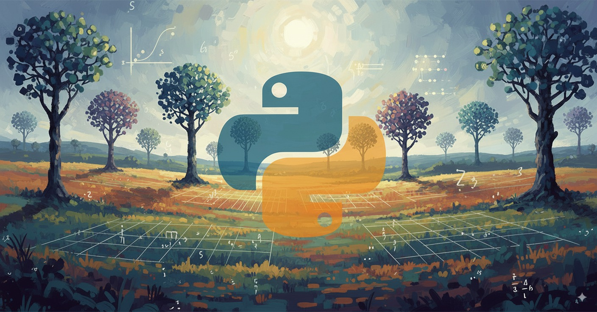

# Языки программирования для машинного обучения и ИИ

## Кратко

Курс даёт практические навыки программирования и работы с инструментами, необходимыми для реализации классических ML‑пайплайнов и прототипирования моделей. Основной язык — Python; акцент на практических навыках и защите работ.

## Цели курса

* Научить эффективно использовать Python‑экосистему для задач МО и подготовки данных.
* Дать навыки быстрого прототипирования модели и развёртывания простого интерфейса.

## Ожидаемые результаты обучения

Вы сможете:

* понимать основы Python, его особенности;
* применять NumPy/Pandas для преобразований и EDA;
* строить и оценивать модели с помощью scikit‑learn;
* быстро прототипировать интерфейс модели (Gradio/FastAPI);
* контейнеризовать приложение и подготовить инструкцию по запуску *(опционально, при наличии времени)*.

## План

1. Введение, обзор курса, требования, организация занятий, критерии защиты практик. Рабочие среды: Pycharm, VS Code. (1 а.ч.)
2. Python — основы синтаксиса, типы, выражения, управление потоком выполнения (if/for/while), исключительные ситуации (1 а.ч.)
   - [exceptions/readme.md](../../exceptions/readme.md)
2. Функции, модули, тестирование  — (1 а.ч.)
   - [package_managers.md](../../package_managers.md): PIP, requirements.txt, UV.
   - [tests/tests.md](../../tests/tests.md)
6. Управление зависимостями: pip, venv, **uv** (1 а.ч.)
   - [virtualenv.md](../../virtualenv.md)
3. Python — структуры данных (list, tuple, dict, set), comprehensions, итераторы, генераторы — (2 а.ч.)
4. Python — функции высшего порядка, модули, пакеты, ООП‑основы, аннотации типов. (1 а.ч.)
   - ООП. 
      - Объявление классов. Методы и поля (объявление в конструкторе). `class`, `__init__`, `self`. Инкапсуляция. Геттеры и сеттеры. Проверка предусловий. `_filed` и `__field`. `@property`, `@prperty.setter`. Пример.
      - Наследование `Deriverd (Base)`. `super`
      - Dataclasses. `@dataclass`. 
      - Методы: `__repr__`, `__str__`, `__eq__`, `__len__`, `__iter__`, `__add__`, `__mul__`
5. Инструменты и среды: Jupyter, VS Code, Google Collaboratory. (1 а.ч.)
7. NumPy: массивы, операции, broadcasting, векторизация (2 а.ч.)
8. Pandas: Series/DataFrame, загрузка/сохранение, запросы и типичные приёмы. (1 а.ч.)
9. Визуализация: matplotlib, seaborn; принципы наглядной визуализации для EDA и отчётов (1 а.ч.)
10. scikit‑learn: API (fit/transform/predict), пайплайны, кросс‑валидация, базовые модели: линейная регрессия, логистическая регрессия. (1 а.ч.)
11. Быстрое прототипирование: Gradio, FastAPI. (2 а.ч.)
   - [../../examples/gradio/](../../examples/gradio/)
   - [../../web_ui/gradio/gradio.md](../../web_ui/gradio/gradio.md)
   - [../../API/readme.md](../../API/readme.md)
   - [../../API](../../API)
12. Docker — концепция и минимальный пример Dockerfile для Python‑приложения *(опционально)*. (1 а.ч.)

Шпаргалка по Питону: https://miro.com/app/board/uXjVNQC1rq8=/?share_link_id=938578428749

## Практики

Git рекомендован, но не обязателен. 
На практиках студенты предоставляют код. Защита — устная демонстрация работы, ответы на вопросы.

## Задания

## Требования к выполнению заданий
* Самостоятельное выполнение. Используйте ИИ-ассистенты только для помощи в изучении необходимых тем и понятий, для решения сложноразрешимых проблем.
* Документирование и пояснение. 
   - Пишите поясняющие комментарии: для блоков кода (например, "цикл для чтения файла с исходными данными"); для сложных, неочевидных мест в программах.
   - Пишите документирующие комментарии для модулей, функций, переменных и т.п. В том числе приводите задание или ссылку на него. Указывайте автора. 
- Соблюдайте рекомендации PEP 8.
- Пишите эффективные по памяти и времени алгоритмы.
- Рекомендуется использовать систему управления версиями Git и платформу GitHub

Задания оформлены как набор работ, которые студенты выполняют между занятиями и защищают на практиках.

1. [Основы Python](tasks/tasks_programming.md)
   - Условный оператор, циклы
   - Списки, множесва, 
   - Функции, модули, тесты для функций
   - Файлы
   - Классы?

1. Pip. Venv. Requirements. uv.
   - Отчёт

2. **NumPy**
См. [Основы Python](tasks/tasks_programming.md)

5. **[Прототип интерфейса (Gradio)](tasks/gradio.md)**

6. **[Прототип API (FastAPI)](tasks/api.md)**

6. **Классы**
Для одной из работ, где использовали FastAPI или Gradio создайте класс, управляющий моделью.
Класс должен содержать поля:
- модель
- R2 или другой подходящий показатель качества
- примечание

Примечание и R2 должны загружаться из отдельного файла.\
Не забудьте документирующие комментарии.

Используйте класс в работе по FastAPI или Gradio.

6. **Окружение и Docker**
   * Dockerfile, requirements.txt, файлы модели и т.п.

# Дополнительные темы
- `httpx` - более быстрая альтернатива `requests`
- Pattern Mathcing
- Асинхронное программирование, процессы и потоки
- ООП(?), data classes
- скрапинг, beautiful soup, selenium
- фреимворки для модульного тестирования
- структуры данных: очереди, стеки, множества, словари и т.д.
- элементы функционального программирования
- JSON и другие форматы
- Работа с БД, с SQL, ORM
