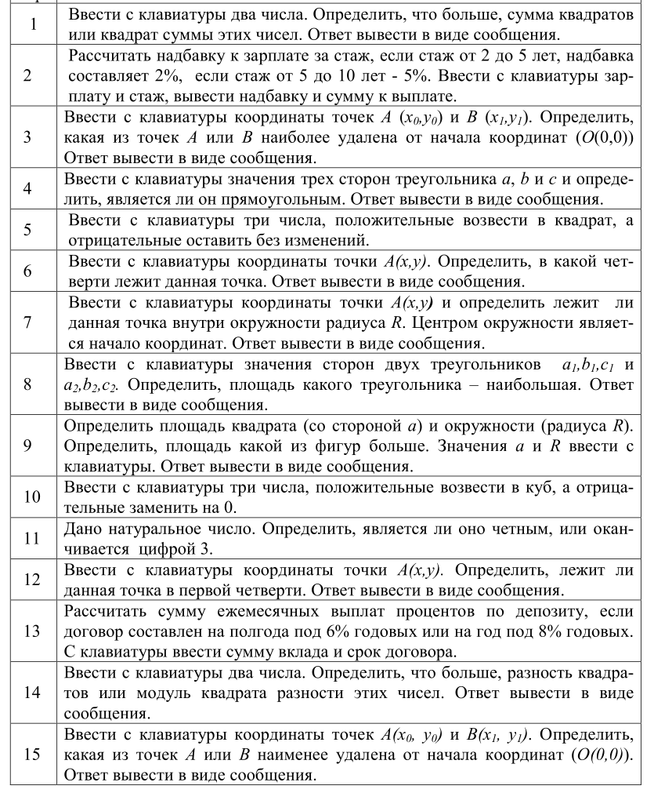
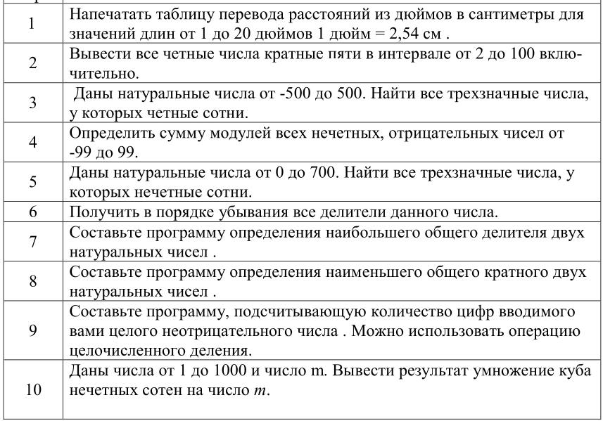
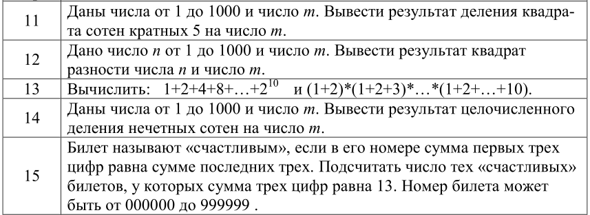

# Задачи

Решите задачи согласно вашему варианту.
Номер варианта приведён слева от текста задачи.

В задачах, где требуется работать с отдельными цифрами числа используйте только целочисленную арифметику. Не переводите число в строку.

Помните, что алгоритмы должен обладать свойством массовости - решать не конкретную задачу с конкретными параметрами, а класс задач с данным условием. 


Если требуется вводить массив или набор из сколь угодно большого числа значений, то используй те генератор случайных чисел.

Программы сохраняйте в py файлы.
В этом файле или readme приводите условие задачи и ссылку на задания.


# Условный оператор 
<!--  -->


# Циклы



# Массивы list и numpy array

**Цель работы** - продемонстрировать навыки работы с типами данных: списки, множества, массивы (numpy); навыки работы с модулями, функциями и навыки тестирования функций. Показать навыки оценивания эффективности алгоритмов. Познакомиться с некоторыми функциями и преобразованиями, которые часто используются в МО.

**Задание**
Используйте парадигму процедурно-модульного программирования.
Помните про принцип единственной ответственности. 
Не забывайте документировать функции. Используйте аннотации типов для аргументов функции.

0. Создавайте функцию для записи списка в текстовый файл. Используйте CSV формат.
1. Создайте набор из случайных чисел без повторов $x_1, x_2, ..., x_n$. Интервал случайных значений $(a,b)$ и количество случайных чисел задаются пользователем. $n<<b−a$
    Четный вариант: набор из их чётных чисел.\
    Нечётный вариант: набор из их нечётных чисел.    
    * Создайте несколько реализаций:
        - Используйте списки (list), модуль random и функцию randint.
        - Используйте множество (set)
        - Используйте массив ndarray из пакета numpy. Не используйте циклы.
    * Сравните время работы этих подходов для
        - $n$ порядка 10^3 - 10^4
        - $n$ порядка 10^6 - 10^7. Увеличьте значение, если позволяет ПК. Если же памяти и вычислительных ресурсов недостаточно, то уменьшите n.\
      Время и выводы (почему такая разница между алгоритмами использующим разные типы данных) запишите в отдельном markdown файле.

2. Обработайте массив согласно заданию варианта
    1. Преобразуйте каждый элемент массива по формуле Сигмоиды. Найдите сумму элементов.
    1. Преобразуйте каждый элемент массива по формуле Сигмоиды. Найдите произведение элементов.
    1. Преобразуйте каждый элемент массива по формуле ReLU. Найдите сумму элементов.
    1. Преобразуйте каждый элемент массива по формуле ReLU. Найдите произведение.
    1. Преобразуйте каждый элемент массива по формуле Tanh. Найдите сумму элементов.
    1. Преобразуйте каждый элемент массива по формуле Tanh. Найдите произведение элементов.
    1. Преобразуйте каждый элемент массива по формуле Softmax. Найдите произведение элементов.
    1. Преобразуйте каждый элемент массива по формуле нормализации. Найдите сумму элементов.
    1. Преобразуйте каждый элемент массива по формуле нормализации. Найдите произведение элементов.
    1. Преобразуйте каждый элемент массива по формуле стандартизации. Найдите сумму элементов.
    1. Преобразуйте каждый элемент массива по формуле стандартизации. Найдите произведение элементов.
    1. Преобразуйте каждый элемент массива по формуле. SoftPlus. Найдите сумму элементов.
    1. Преобразуйте каждый элемент массива по формуле. SoftPlus. Найдите произведение элементов.
    1. Преобразуйте каждый элемент массива по формуле. Гаусова функция. Найдите сумму элементов.
    1. Преобразуйте каждый элемент массива по формуле. Гаусова функция. Найдите произведение элементов.

    **Формулы**
    - Сигмоида $\sigma(x) = \frac{1}{1+e^{-x}}$
    - $ReLU(x) = {\begin{cases}0&x<0\\x&x\geqslant 0\end{cases}}$
    - Гиперболический тангенс $Th(x) = \frac{ e^x - e^{-x} } {e^x + e^{-x}}$
    - $Softmax(x) = \frac{e^x}{S}$, где $S = \sum e^{x_i}$, $x_i$ - элемент массива.
    - Нормализация значеняи: $f(x) = \frac{x - min(x)}{max(x) - min(x)}$. Для для вычисления минимума и максимума используйте стандартные функции.
    - Стандартизация: $z(x) = \frac{x - \bar x}{sd(x)}$. Для для вычисления среднего значения в массиве ($\bar x$) и стандартного отклонения ($sd(x)$) используйте библиотечные функции.
    - $SoftPlus(x) = \ln(1+e^x)$
    - Гаусова функция $f(x) = e^{-x^2}$


    * Если в при проверке на больших массивах результат произведения получается нулевым или сумма получается равной бесконечности, то находите произведение \ сумму на элементов массива, а логарифмов модуля элемента массива $ln|x_i|$ или $ln|x_i+1|$ (если $\exists x_i = 0$  )

3. Напишите 3 или более теста для функции из п. 2. Используйте оператор assert или фреимворк для модульного тестирования. 

## Справка

### Измерение времени работы кода
https://docs.python.org/3/library/timeit.html

`timeit` измеряет wall-clock (реальное) время выполнения выражения. См. также, способы измерения CPU-time (процессорное время, которое не включают время ожидания ввода/вывода или простоя).

```python
import timeit

# функция, время работы которой нужно измерить
def my_func(n:int = 1000_000):
    S: float = 0.0
    for i in range(1,n+1):
        S += 1/i
    return S


NUMBER = 10     # сколько раз повторять в рамках одной серии измерений времени
REPEAT = 3      # сколько раз повторять серия измерений времени
raw_times = timeit.repeat(lambda: my_func(),
                          repeat=REPEAT, number=NUMBER)

print(raw_times)
# Результат - массив из 3 измерений. Элемент массива - суммарное время работы за 10 запусков
[0.40726195499883033, 0.3868291310209315, 0.38420279300771654]
```

Параметр `repeat` можно задать > 1 чтобы меняется, как время меняется от запуска к запуску.
Увеличивайте `number`, пока суммарное время серии не станет достаточным (например порядка нескольких секунд). Малое значение времени даёт высокую погрешность.

Например, если repeat = 1, number = 1. То есть риск, что время выполнение функции может быть большим только за счёт того, что другие программы (например антивирус) или сборщик мусора в этот момент также активно потребляют процессорное время.    


См. также подход, где код записывается в виде строки и дополнительно можно передать функцию setup для настройки отдельного запуска:
```py
timeit.repeat(stmt="f()", setup="x = prepare(); from __main__ import f", number=100, repeat=3)
```

# Виртуальное окружение

**Цель.** Научиться создавать воспроизводимое виртуальное окружение (venv), управлять зависимостями и собрать окружение, которое пригодится для ML проектов.

## Задание

1. Создайте папку для будущего проекта и инициализируйте в ней виртуальное окружение `.venv`.
2. Подготовьте файлы с перечнем пакетов
    - `requirements_ML.txt` с пакетами:
   `numpy, pandas, scikit-learn, seaborn, plotly`
    - `requirements_service.txt` с пакетами:
    `fastapi, uvicorn[standard], gradio` 
    - `requirements_jupyter.txt` с пакетами: `jupyter` (пакет для работы с jupyter notebook) `ipython` (пакет для интерактивного выполнения кода).

4. Добавьте `README.md` с инструкцией: как создать/активировать окружение, установить зависимости. Добавьте в этот файл также раздел с отчётом о выполненной работе: скриншоты введённых команд, описание трудностей с которыми столкнулись. 

5. Рекомендуется использовать git и github.
`.venv` в репозиторий не включать — добавьте `.gitignore`.

3. *Бонус: Сделайте простой FastAPI-приложение `app/main.py` с эндпоинтом':*
   * `GET /ping` → `{"status":"ok"}`

6. *Бонус: аналогично пункту 3, но используйте пакет `uv`* 


Шпаргалка по Virtual Environment https://github.com/VetrovSV/Programming/blob/master/virtualenv.md

## Следующие задания
- [gradio.md](./gradio.md)
- [api.md](./api.md)


