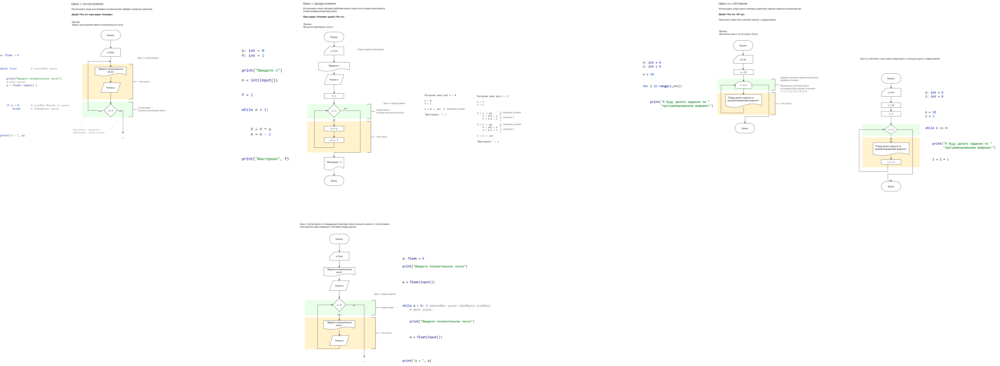
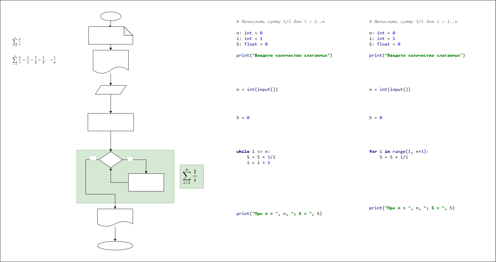
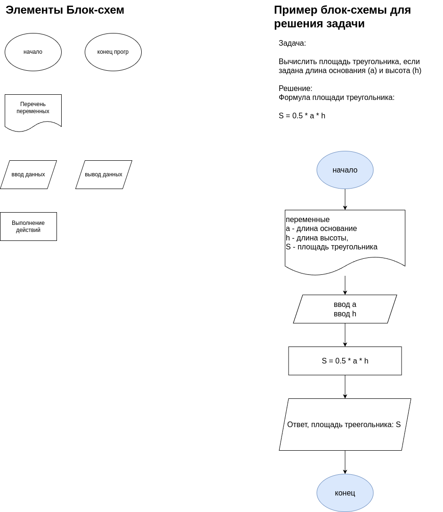

# Основы алгоритмизации и программирования

# О курсе
- Курс проходит во втором семестре. 
- Заканчивается зачётом, в последнюю неделю июня
- 24 лекции и 24 практики

#### Цель изучения курса
Получить базовые навыки программирования на языке Python, необходимые для автоматизации рутинных задач, работы с данными и создания простых программ, которые могут быть применены в их профессиональной деятельности в сфере сетевого и системного администрирования.  

Заложить фундамент для дальнейшего изучения сложных аспектов программирования и IT-автоматизации.

#### Результат успешного прохождения курса
1. Будете знать основные принципы алгоритмизации и их применение для решения практических задач.  
2. Будете знать основы Python.
1. Будете уметь разрабатывать алгоритмы и реализовывать их в виде программ на Python для решения практических задач, включая обработку данных и автоматизацию.  
4. Выполнять базовое отладку кода, находить и исправлять ошибки, используя средства IDE PyCharm.  

# Занятие 10. Лекция. Циклы

# Задание. Циклы.
Задания из 11 и 12 строки задачника.
1. Опишите алгоритмы в виде блок-схемы
2. Распишите 3-4 итерации цикла, с указанием проверок условий и изменением переменной
3. Напишите программу на Python для этих задач

# Занятие 8-9. Практика

# Занятие 7. Практика + Лекция. Отладчик
24 февраля

1. Возьмите одну из ваших программ с ветвлением.
1. Разберитесь как поставить точку останова. Что это такое? Как запустить программу, чтобы точка останова сработала?
1. Выполните программу до точки останова. Далее выполнить программу по шагам до конца. Какие кнопки и горячие клавиши за это отвечают? Как выполнить программу до конца после точки останова?
4. Опишите это всё отчёте. Делайте скриншоты. Отчёт представьте в виде текстового документа (Google Docs, Яндекс.Документы или Word).

# Домашнее задание. Отчёт об отладке

# Занятие 6. Практика
17 февраля

# Занятие 5. Лекция + практика (?). Условый оператор.
11 февраля
1. Повторение.
1. Выражения. Арифметические и логические выражения. Тип данных bool.
1. Условный оператор:
    - представление на блок-схемах. Вложенные условия.
    - использование в Питоне: if, else, elif; вложенность и отступы
2. Операторы сравнения: ==, >, <, <=, >=    
3. Логические операторы: not, or, and; Таблицы истинности. Приоритет операторов.

Пример из лекции: https://github.com/VetrovSV/Programming/blob/master/examples/python_intro/20_math_if.py 

паргалка по Питону: https://miro.com/app/board/uXjVNQC1rq8=\
Смотрите там приоритет операторов и другие примеры использования оператора if

### Домашнее задание
- Конспект: Алгоритм. Свойства алгоритма.
- Конспект: Этапы разработки ПО. Критерии качества ПО?
- Выполните задания из строк 4 и 5 задачника в виде блок-схем и в виде программы на Python

# Занятие 4. Практика
4 февраля

# Занятие 3. Лекция: Введение в Python
- Создание проектов в PyCharm. Hello, World. Запуск проектов.
- Введение в Python:
    - Характеристика языка программирования
    - Ввод и вывод, форматные сроки (s-strings)
    - Комментарии
    - Переменные и типы данных: int, float, str
    - Преобразование типов данных

Создание проектов в PyCharm.
<!-- 
 -->

1. Убедитесь, что у вас установлен Python 
2. Используйте бесплатную версию PyCharm - PyCharm Community
3. Откройте PyCharm. Если сразу открылся старый проект, который вы не хотите использовать, то закройте его: Меню File > Close Project
4. Нажмите кнопку **New Project** в стартовом окне:

5. Настройте проект

    - Зaдайте парку для сохранения проекта - **Location**\
    Удобнее всего выбрать папку в специальном окне, которое открывается но нажатию на значёк папки (см. рис); **Создавайте новую папку** для своего проекта.
    - Убелитесь, что задан интерпретатор - программа Python, которая будет исполнять вашу программу.\
    Поле **Python version не должно быть пустым**.
    - Нажмите **Create**
    
6. Добавьте новый в проект.\
В нём вы будете писать код.
    - Найдите раздел с файлами проекта (Project) в левой части окна
    - Сделайте правый клик на папке вашего проекта: New -> Python File
    
    - Задайте осмысленное имя файла в появившемся окне. Нажмите Enter.
    
    - Файл добавлен:
    
7. Начните писать программу.
8. Запустите файл с программой

9. В нижней части окна PyCharm появится новый раздел Run, в котором вы увидите результат выполнения вашей программы:

<!-- 
 -->

Смотрите запись занятия в ТГ-канале.

# Занятие 2. Практика
21 января
- Повторение. Уточнение к блок-схемам.

# Занятие 1. Введение в предмет
14 января
- О курсе. Литература и материалы.
- Элементы блок-схем. 
- Высокоуровневые и низкоуровневые языки программирования. Транслятор. Интерпретатор и компилятор.
- Понятие алфавита, синтаксиса и семантики.

Задачник: https://ivtipm.github.io/Programming/Files/spisocall.htm

Для рисования блок-схем: https://app.diagrams.net/

Шпаргалка по Питону: https://miro.com/app/board/uXjVNQC1rq8=

**Блок-схемы**

### Домашнее задание: Литература и ПО
- Раздобыть рекомендованную литературу по Питону
- Установить интерпретатор Python (https://www.python.org/downloads/) и IDE PyCharm (https://www.jetbrains.com/pycharm/download/?section=linux)

### Домашнее задание: Блок схемы для линейных алгоритмов
Опишите алгоритмы решения задачи из строк 1 и 3 задачника в виде блок-схемы.

Используйте draw.io для создания блок-схем. Сохраняйте результат как png изображение (предпочтительно) или как ссылку. Не сохраняйте результат как скриншот экрана.

Помимо блок-схемы приводите:
- ФИО
- Номер задачи: номер строки из задачника, номер задачи
- Условие задачи, если нужно добавляйте изображений
- Пояснения к алгоритму, формулам и т.п.
