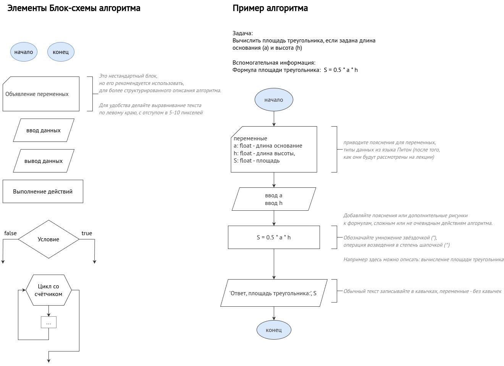

# Основы алгоритмизации и программирования

# О курсе
- Курс проходит во втором семестре. 
- Заканчивается зачётом, в последнюю неделю июня
- 24 лекции и 24 практики

#### Цель изучения курса
Получить базовые навыки программирования на языке Python, необходимые для автоматизации рутинных задач, работы с данными и создания простых программ, которые могут быть применены в их профессиональной деятельности в сфере сетевого и системного администрирования.  

Заложить фундамент для дальнейшего изучения сложных аспектов программирования и IT-автоматизации.

#### Результат успешного прохождения курса
1. Будете знать основные принципы алгоритмизации и их применение для решения практических задач.  
2. Будете знать основы Python.
1. Будете уметь разрабатывать алгоритмы и реализовывать их в виде программ на Python для решения практических задач, включая обработку данных и автоматизацию.  
4. Выполнять базовое отладку кода, находить и исправлять ошибки, используя средства IDE PyCharm.  

# Занятие 2
21 января
- Повторение. Уточнение к блок-схемам.
- Алгоритмы: линейные, ветвление, циклы.
- Создание проектов в PyCharm. Hello, World. Запуск проектов.
- Введение в Python:
    - Характеристика языка программирования
    - Ввод и вывод, форматные сроки (s-strings)
    - Комментарии
    - Переменные и типы данных: int, float, str
    - Динамическая типизация
    - Преобразование типов данных

### Домашнее задание
- Конспект: Этапы разработки ПО. Критерии качества ПО?

### Ссылки
Дополнительно: О точности записи алгоритма https://www.youtube.com/watch?v=cDA3_5982h8

# Занятие 1. Введение в предмет
14 января
- О курсе. Литература и материалы.
- Элементы блок-схем. 
- Высокоуровневые и низкоуровневые языки программирования. Транслятор. Интерпретатор и компилятор.
- Понятие алфавита, синтаксиса и семантики.

Задачник: https://ivtipm.github.io/Programming/Files/spisocall.htm

Для рисования блок-схем: https://app.diagrams.net/

Шпаргалка по Питону: https://miro.com/app/board/uXjVNQC1rq8=

**Блок-схемы**

### Домашнее задание: Литература и ПО
- Раздобыть рекомендованную литературу по Питону
- Установить интерпретатор Python (https://www.python.org/downloads/) и IDE PyCharm (https://www.jetbrains.com/pycharm/download/?section=linux)

### Домашнее задание: Блок схемы для линейных алгоритмов
Опишите алгоритмы решения задачи из строк 1 и 3 задачника в виде блок-схемы.

Используйте draw.io для создания блок-схем. Сохраняйте результат как png изображение (предпочтительно) или как ссылку. Не сохраняйте результат как скриншот экрана.

Помимо блок-схемы приводите:
- ФИО
- Номер задачи: номер строки из задачника, номер задачи
- Условие задачи, если нужно добавляйте изображений
- Пояснения к алгоритму, формулам и т.п.
