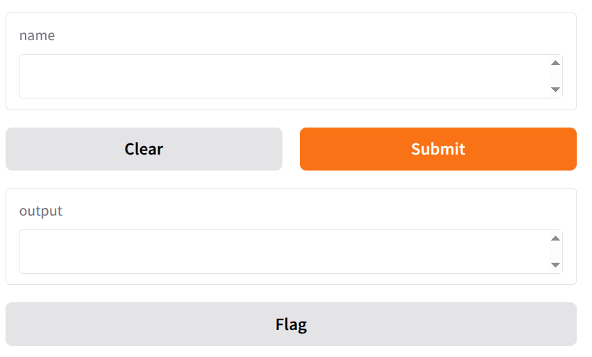

Машинное обучение применяется во многих сферах — от бизнеса до медицины, но большая часть моделей по-прежнему (и изначально) работает в виде скриптов или Jupyter-ноутбуков. Чтобы провести тестирование работы модели или просто показать её заказчикам, нужен простой визуальный интерфейс. 

Веб-интерфейсы позволяют быстро и удобно опробовать модель на разных данных, пробовать разные сценарии и получать обратную связь. Это особенно полезно для задач, где важно видеть результат *здесь и сейчас*, например: ручная проверка классификации, запуск новых гипотез или создание учебных демо.

# Библиотеки для создания UI

Самые популярные библиотеки, которые особенно удобно использовать для создания веб-интерфейса для приложений на основе ML.


| Библиотека  |                                                                                                                                                                             Популярность | Простота                                                                                                                | Возможности                                                                                                  | Деплой и шаринг                                                                             | Гибкость интерфейса                                                                                              | Интеграция с ML                                                                                           | Документация                                                                                               | Для чего лучше всего                                                                                                 |                                                                                                |
| ---------------------- | ----------------------------------------------------------------------------------------------------------------------------------------------------------------------------------------------------------------------------------------------------: | ----------------------------------------------------------------------------------------------------------------------- | ------------------------------------------------------------------------------------------------------------ | ------------------------------------------------------------------------------------------- | ---------------------------------------------------------------------------------------------------------------- | --------------------------------------------------------------------------------------------------------- | ---------------------------------------------------------------------------------------------------------- | -------------------------------------------------------------------------------------------------------------------- | ---------------------------------------------------------------------------------------------- |
|            |                                                                                              **GitHub:** ~40.2k ★ / 3.1k ⑂. (GitHub) **PyPI (last month):** ~9.55M загрузок. (PyPI Stats) (StackShare: страница проекта). (StackShare) | Очень просто — минимальный код, готовые виджеты; отлично для быстрых демо.                                              | Виджеты для ML I/O (картинки, аудио, текст), быстрый просмотр моделей.                  | Мгновенные публичные ссылки, Hugging Face Spaces, встраивание в ноутбуки. (gradio.app) | Простейший UI для демо; для кастомного сложного UI придётся дописывать.                                          | Нативная поддержка моделей (HF, Torch, sklearn) и примеры.                                                | Много туториалов и шаблонов; хорошая доступность для новичков.                                             | Быстрое демонстрирование/проверка ML-моделей, интерактивные демо.                                                    |                                                                                                |
| **Streamlit**          |                                                                                             **GitHub:** ~41.8k ★ / 3.8k ⑂. (GitHub) **PyPI (last month):** ~16.86M загрузок. (PyPI Stats) (StackShare: страница проекта). (StackShare) | Очень просто для большинства задач; API декларативный — легко стартовать.                                               | Широкие возможности по кастомизации интерфейса, поддержка навигации, внешний JS/компоненты через компоненты. | Streamlit Cloud (share), легко CI/CD, много интеграций. (share.streamlit.io)           | Гибкий — много UI-компонентов, можно использовать кастомный JS через API.                                        | Удобно интегрировать модели; экосистема компонентов для визуализации.                                     | Официальная и большая документация; много примеров/сообщества. (PyPI Stats)                           | Прототипы, визуализация данных, внутренние инструменты исследователей и аналитиков.                                  |                                                                                                |
| **Dash (Plotly Dash)** |                                                                                            **GitHub:** ~24.2k ★ / 2.2k ⑂. (GitHub) **PyPI (last month):** ~5.04M загрузок. (PyPI Stats) (StackShare: страница проекта). (StackShare) | Требует больше кода и архитектурных решений; подразумевает понимание callbacks.                                         | Очень гибкий для дашбордов, сложных визуализаций; поддержка кастомного JS/HTML.                              | Любой Flask-friendly хостинг; хорошая поддержка крупного деплоя и корпоративных сценариев.  | Наибольшая гибкость при комплексных UI (React-подкапот), но выше порог.                                          | Готовые компоненты под ML/визуализацию; хорошо подходит для аналитики.                                    | Документация большая и ориентирована на серьёзные дашборды и примеры. (dash.plotly.com)              | Сложные корпоративные дашборды, BI-проекты и аналитические приложения.                                               |                                                                                                |
| **Reflex**             | **GitHub:** ~26k ★ / 1.5k ⑂. (GitHub) **PyPI:** пакет `reflex` есть (релиз 06 Oct 2025); детальные агрегаты скачиваний (PyPIStats) для reflex в момент сбора были недоступны/неоднозначны — поэтому здесь даю ссылку на PyPI/repo. (PyPI) | Всё на Python; API стремится быть простым, но концепция full-stack (frontend+backend) добавляет сложности для новичков. | Можно строить полноценные сервисы: страницы, state-модель, компоненты; быстро вырастают в full-stack app.    | Есть Reflex Cloud (хостинг/деплой), опции on-prem. (GitHub)                           | Полная кастомизация, но требует привыкания к парадигме (всё в Python).                                           | Можно строить любые пайплайны и интерфейсы; пока экосистема моложе, чем у Streamlit/Gradio.               | Можно интегрировать ML, но нет множества ready-made ML-виджетов (как у Gradio).                            | Документация и примеры быстро растут, но сообщество моложе — материалы есть на сайте и в репозитории. (GitHub) | Full-stack Python-приложения без JS (полноценные web-apps, internal tools, AI apps с деплоем). |
| **Taipy**              |                                                                  **GitHub:** ~18.8k ★ / 1.9k ⑂. (GitHub) **PyPI (taipy-core, last month):** ~11.8k загрузок (taipy-core). (PyPI Stats) (StackShare: страница проекта). (StackShare) | Немного выше порог входа, особенно при продакшн-потребностях; визуальный дизайнер упрощает некоторые сценарии.          | Мощная оркестрация и what-if-анализы, сценарные эксперименты, пайплайны.                                     | Поддержка развёртывания на серверах, планировщики, корпоративные фичи.                      | UI ориентирован на аналитические сценарии; Designer/Studio дают low-code подход, но ручная кастомизация сложнее. | Хорош для оркестрации экспериментов, сценариев и production-pipelines; интеграция ML на уровне процессов. | Документация фокусируется на корпоративных кейсах и пайплайнах; есть официальные туториалы. (GitHub) | Аналитика «что-если», сценарные эксперименты, production-ориентированные data/ML apps.                               |                                                                                                |


# Gradio
**[Gradio](https://www.gradio.app/)** — отличный старт для знакомства с ML UI: максимально прост (минимум кода), нативно интегрирован с библиотеками для ML, идеально подходит чтобы быстро и наглядно показать модель — с возможностью быстро поделиться с другими. При этом не требуется изучения основ веб-разработки.

Библиотека разрабатывается компанией Hugging Face, которая развивает открытую платформу и сообщество для работы с моделями МО.

Преимущества:
- быстрая установка и запуск;
- простота;
- поддержка большинства ML-библиотек;
- понятная документация;
- возможность запустить и поделиться приложением через браузер в один клик (или выгрузить в Hugging Face Spaces, если нужно постоянное публичное демо).


**Ссылки**
* Песочница с запуском кода - https://www.gradio.app/playground
* Quickstart - https://www.gradio.app/guides/quickstart

*В 2023 году API Gradio частично поменялся, поэтому не все примеры из неофициальной документации актуальны*

**Пример**
```py
import gradio as gr


def greet(name):
    return "Hello " + name + "!"


demo = gr.Interface(fn=greet, inputs="textbox", outputs="textbox")

if __name__ == "__main__":
    demo.launch()
```




## Компоненты
2. Разбор основных компонентов Gradio
Gradio позволяет быстро строить интуитивные веб-интерфейсы для ML-приложений с помощью компонентов — “виджетов”, представляющих разные типы входных и выходных данных. Ключевой концепт: ты связываешь входные компоненты с Python-функцией (например, предсказание модели), а выходные — отображают результат.


Основные понятия
* Компонент — элемент интерфейса (например, текстовое поле, загрузка файла, график), с которым пользователь может взаимодействовать.
* Входные компоненты — то, что пользователь «даёт» модели (текст, числа, файл/изображение, чекбокс).  эквивалентны аргументам функции.
* Выходные компоненты — то, что интерфейс «показывает» в ответ (предсказание, график, картинка, метка). Эквивалентны возвращаемым значениям функции


**Компоновщики**
* `Interface` — это высокоуровневый компоновщик
    - Обычно соответствует одной веб-странице с простым UI.
    - Удобный, простой способ описать одностраничное приложение.
    - Создаёт типичную веб-страницу с формой из входных и выходных компонентов.
    - Настройка интерфейса ограничена главным образом набором входных и выходных компонентов и их порядком.
    - Идеален, если нужно быстро создать веб-прототип без сложного макета.

    Концепция: создаётся функция fn, список входных и выходных компонентов, а Gradio создаёт веб-форму, которая будет обрабатываться функцией fn.

* `Blocks` — низкоуровневый и более гибкий компоновщик
    - Позволяет создавать страницы с произвольной структурой (несколько колонок, строк, вкладок и др.).
    - Позволяет строить многоэтапные приложения с условной логикой, событиями (onclick, onchange), сложным взаимодействием компонентов.
    - Программист определяет где и как компоненты располагаются, чем они связаны и когда вызываются функции.
    - Можно делать полноценные веб-страницы со сложными интерфейсами, разбитыми на вкладки, секции, “аккордеоны” и др.


Справочник компонентов в Gradio: https://www.gradio.app/docs/components/


### Входные компоненты (input components)

**Способы создания компонентов**

1. Краткое указание типа компонента в виде строки
    ```py
    import gradio as gr

    def greet(name):
        return f"Привет, {name}!"

    form = gr.Interface(fn=greet, inputs="textbox", outputs="textbox"); 
    form.launch()
    ```
2. Создание экземпляров соответствующих классов компонентов
    ```py
    import gradio as gr

    def greet(name):
        return f"Привет, {name}!"

    form = gr.Interface(
        fn=greet,
        inputs=gr.Textbox(lines=2, placeholder="Введите ваше имя", label="Имя пользователя"),
        outputs=gr.Textbox(label="Приветствие")
    )
    form.launch()
    ```

**Списки компонентов**
Можно передавать сразу список компонентов в параметрах inputs и outputs при создании интерфейса (например, `inputs=['textbox', 'slider']`). Это создаст форму с несколькими полями ввода в указанном порядке, которая будет передавать данные функции как несколько отдельных аргументов.

Аналогично можно использовать списки и для компонентов, создаваемых как объекты: 
```py
inputs=[gr.Textbox(label="Ввод"), gr.Slider(minimum=0, maximum=10)]
```

#### 1. **TextBox**

- **Описание**: Обычное текстовое поле для ввода строки.
- **Применение**: Ввод параметра, вопроса, ключа, имени.
- **Пример**:
  ```python
  import gradio as gr

  def greet(name):
      return f"Привет, {name}!"

  gr.Interface(greet, gr.Textbox(label="Введите имя"), gr.Textbox(label="Приветствие")).launch()
  ```
- [Документация TextBox](https://www.gradio.app/docs/textbox/)

#### 2. **Number / Slider**

- **Описание**: Числовой ввод; Slider — удобно для диапазонов.
- **Применение**: Ввод параметров модели, настройка гиперпараметров.
- **Пример**:
  ```python
  def square(x):
      return x**2

  gr.Interface(square,
               gr.Slider(minimum=0, maximum=100, label="Число"),
               gr.Textbox(label="Квадрат")).launch()
  ```
- [Документация Slider](https://www.gradio.app/docs/slider/)

#### 3. **Checkbox / Radio**

- **Описание**: Выбор булевого значения или одного из нескольких вариантов.
- **Применение**: Включение опций, переключение режимов.
- **Пример**:
  ```python
  def mode(use_bonus):
      return "Режим: бонус" if use_bonus else "Режим: стандартный"

  gr.Interface(mode, gr.Checkbox(label="Включить бонус"), gr.Textbox(label="Выбранный режим")).launch()
  ```
- [Документация Checkbox](https://www.gradio.app/docs/checkbox/)
- [Документация Radio](https://www.gradio.app/docs/radio/)

#### 4. **File / Image**

- **Описание**: Загрузка файла или картинки (через drag&drop).
- **Применение**: Использование изображений, аудио, .csv для теста модели.
- **Пример**:
  ```python
  def image_shape(img):
      import PIL.Image
      image = PIL.Image.open(img)
      return image.size

  gr.Interface(image_shape,
               gr.Image(type="filepath", label="Загрузите изображение"),
               gr.Textbox(label="Размер")).launch()
  ```
- [Документация Image](https://www.gradio.app/docs/image/)

#### 5. **Dropdown**

- **Описание**: Выпадающий список.
- **Применение**: Классический выбор категорий — например, выбрать тип задачи или алгоритм.
- **Пример**:
  ```python
  def select_algo(algo):
      return f"Выбран алгоритм: {algo}"

  gr.Interface(select_algo,
               gr.Dropdown(choices=["Linear", "Tree", "SVM"], label="Алгоритм"),
               gr.Textbox(label="Результат")).launch()
  ```
- [Документация Dropdown](https://www.gradio.app/docs/dropdown/)

***

### Выходные компоненты (output components)

#### 1. **TextBox / Label**

- **Описание**: Для отображения текста или метки.
- **Применение**: Вывод предсказания, комментария, вероятностей.
- **Пример**:
  ```python
  def predict_age(name):
      # "Модель" — просто пример
      return f"Возраст {name}: 25 лет"

  gr.Interface(predict_age, gr.Textbox(label="Имя"), gr.Label(label="Предсказание возраста")).launch()
  ```
- [Документация Label](https://www.gradio.app/docs/label/)

#### 2. **Plot**

- **Описание**: Для вывода графиков (matplotlib, plotly, seaborn).
- **Применение**: Визуализация результатов регрессии, распределения, метрик.
- **Пример (matplotlib)**:
  ```python
  def make_plot(a, b):
      import matplotlib.pyplot as plt
      fig, ax = plt.subplots()
      ax.plot([0, 1], [a, b])
      return fig

  gr.Interface(make_plot, [gr.Number(label="A"), gr.Number(label="B")], gr.Plot()).launch()
  ```
- [Документация Plot](https://www.gradio.app/docs/plot/)

#### 3. **Image**

- **Описание**: Показывает изображение.
- **Применение**: Воспроизведение результата сегментации, генерации, предсказания.
- **Пример**:
  ```python
  def invert(img):
      from PIL import Image, ImageOps
      image = Image.open(img)
      inverted = ImageOps.invert(image.convert("RGB"))
      return inverted

  gr.Interface(invert, gr.Image(type="filepath", label="Исходное изображение"), gr.Image(label="Инвертированное изображение")).launch()
  ```
- [Документация Image](https://www.gradio.app/docs/image/)

#### 4. **Dataframe**

- **Описание**: Таблицы (например, pandas.DataFrame).
- **Применение**: Отображение таблиц результатов, списков входных данных, метрик.
- **Пример**:
  ```python
  def show_df(file):
      import pandas as pd
      df = pd.read_csv(file.name)
      return df.head()

  gr.Interface(show_df, gr.File(label="CSV файл"), gr.Dataframe(label="Таблица")).launch()
  ```
- [Документация Dataframe](https://www.gradio.app/docs/dataframe/)


### Привязка компонентов к модели и функции

В Gradio каждый компонент — это «точка» передачи данных в Python-функцию. Программист задаёт:
- какие компоненты на вход (например, gr.Textbox, gr.Image);
- какие на выход (например, gr.Label, gr.Plot).

**Пример интерфейса для sklearn.linear_model.LinearRegression:**
```python
from sklearn.linear_model import LinearRegression
import gradio as gr
import numpy as np
# для примера тут приведено обучение модели, но готовая модель должна загружаться из файла
model = LinearRegression()
X = np.array([[1], [2], [3], [4]])
Y = np.array([2, 4, 6, 8])
model.fit(X, Y)

# Принимает число, выводит предсказание
def predict(x):
    return float(model.predict([[x]]))

gr.Interface(
    fn=predict,
    inputs=gr.Number(label="Значение X"),
    outputs=gr.Number(label="Оценка Y")
).launch()
```

***

## Blocks — для более сложных сценариев

Если нужно сделать интерфейс из нескольких компонентов, управлять макетом, строить последовательности действий (например, загрузка файла → выбор параметра → обработка), стоит использовать Gradio Blocks:
- **Row, Column, Tab** — компоненты для организации интерфейса.
- **Event handling** — можно связывать кнопки (“on_click”) с обработкой.

**Пример: две вкладки — предсказание и график**
```python
import gradio as gr
from sklearn.linear_model import LinearRegression
import numpy as np
import matplotlib.pyplot as plt

model = LinearRegression()
X = np.array([[1],[2],[3],[4]])
Y = np.array([2,4,6,8])
model.fit(X,Y)

def predict(x):
    return float(model.predict([[x]]))

def plot():
    fig, ax = plt.subplots()
    ax.scatter(X, Y)
    ax.plot(X, model.predict(X), color="red")
    return fig

with gr.Blocks() as demo:
    with gr.Tab("Предсказание"):
        inp = gr.Number(label="X")
        out = gr.Number(label="Y")
        btn = gr.Button("Сделать предсказание")
        btn.click(predict, inp, out)
    with gr.Tab("График"):
        plot_btn = gr.Button("Построить график")
        plot_area = gr.Plot()
        plot_btn.click(plot, None, plot_area)

demo.launch()
```

Базовая документация Blocks: [https://www.gradio.app/docs/blocks/](https://www.gradio.app/docs/blocks/)


### Советы по работе с компонентами

- Задавайте метки (`label`) у каждого компонента — помогает понять, что требуется пользователю.
- Используйте `type`, при работе с файлами или изображениями (например, `type="filepath"`), чтобы избежать ошибок.
- Для сложных форм из нескольких полей воспользуйтесь Blocks (см. выше). Можно собрать нужную структуру интерфейса с помощью Row, Column, Tab и других layout-компонентов.


**Ссылки на документацию и справочники:**
- Список всех компонентов Gradio: [https://www.gradio.app/docs/components/](https://www.gradio.app/docs/components/)
- Blocks: [https://www.gradio.app/docs/blocks/](https://www.gradio.app/docs/blocks/)
- Основные туториалы: [https://www.gradio.app/guides/getting_started](https://www.gradio.app/guides/getting_started)
- Готовые демо-примеры: [https://www.gradio.app/guides/examples](https://www.gradio.app/guides/examples)